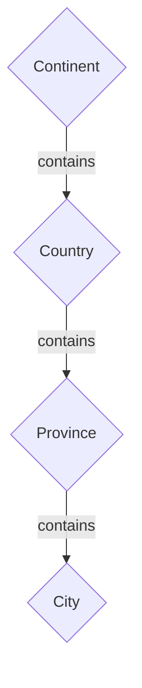
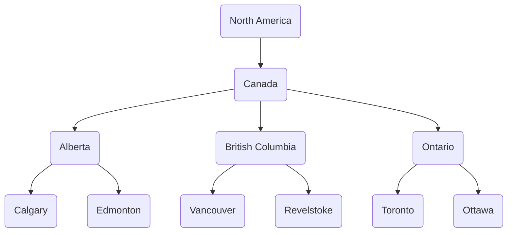
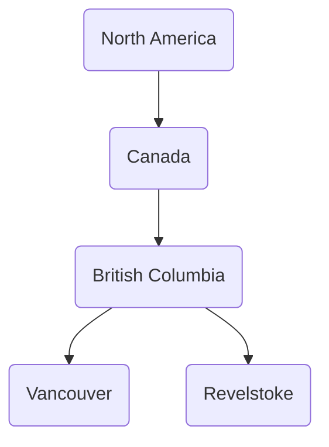
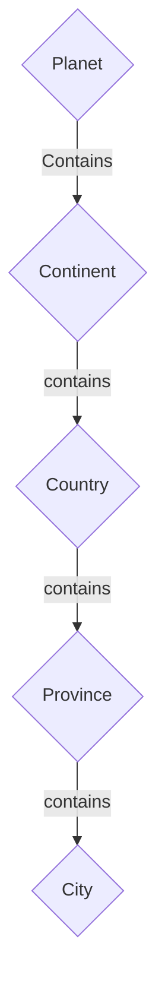
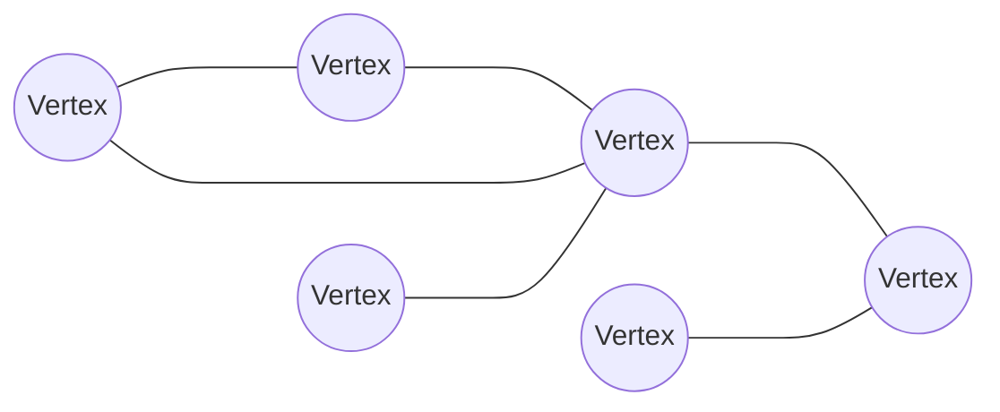
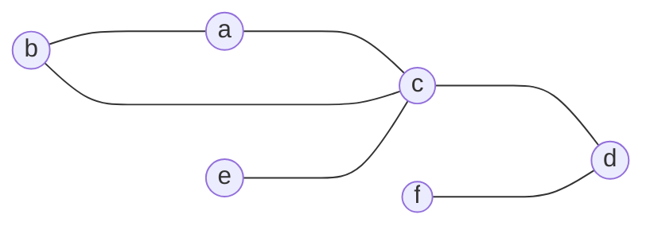
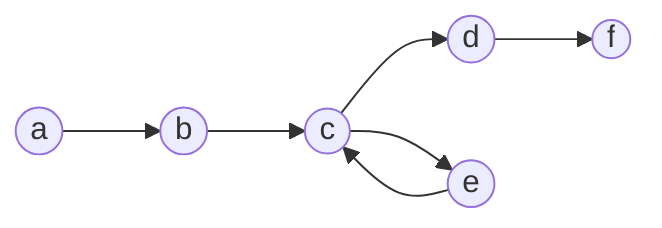
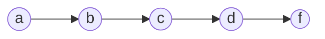
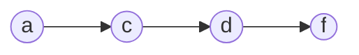

## Struct
...
## Interface
...
## Class
...
## Enumerator
...
## Iterators

...

## Recursive Types
...

## Trees
This is a computer science concept that comes up **a lot**. The basics are that a graph/tree is a collection of nodes that are linked together. Nodes can represent anything, but usually they represent an object in a hierarchy. A hierarchy is just a fancy name for a structure that shows categories that are related in some way to all of the categories beneath them. This means tree's will have a "starting point" from which the other Nodes flow from (called the root). For example when talking about a location you might have a hierarchy that looks like this:



  

Where the overall category is A location from there you have continents, which contain countries, which contain provinces, which contain cities. In code this can be done using an object ([[Programming Paradigms (TODO)#Object oriented|object oriented]]), or [[#Struct]] ([[Programming Paradigms (TODO)#Procedural|Procedural]]). For example to represent some cities in Canada we could have:


  
We can then represent it by having a Node [[#class]] or [[#Struct]]. We're going to represent the subtree of BC:


here is the pseudocode for each:

```
// Struct Version
Struct Node{
	label: String
	parent: Null or List of Node's
	child: Null or List of Node's
}

// Class Version
Class Node:
	label: String
	parent: Null or List of Node's
	child: Null or List of Node's


// Using either

/// Create Children
vancouver = Node("Vancouver", Null, Null)
revelstoke = Node("Revelstoke", Null, Null)

/// Create Parent node with children
bc = Node("British Columbia", Null, [vancouver, revelstoke])

/// Add parent to children
vancouver.parent = bc
revelstoke.parent = bc

/// Create parent Node with children
canada = Node("Canada", Null, [bc])

/// Add parent to children
bc.parent = canada

/// Create parent Node with children
na = Node("North America", Null, [canada])

/// Add parent to children
canada.parent = na
```

This is a useful visualization because each edge (arrow/line) tells you what the node is related to. So if we later want to check what cities are in Canada, we go to the Canada node, and then search all the children, then the children's children:

```
cities = []
for province in canada.children{
	for city in province.children{
		cities.add(city)
	}
}
```

This also means unlike just a traditional list/array if our model expands we have to update very few nodes. For example let's say we become space fairing, and as part of that our location tree now needs to specify which planet we're talking about. To add that node we simply add in the Planet node, and then attach the continent node to the planet (updating 1 reference in our case).

**Uses & references**:
- [Making categories simpler | Schulich Ignite](https://schulichignite.com/blog/taxonomical-ordering/)
- The DOM
	- [Understanding the DOM — Document Object Model | DigitalOcean](https://www.digitalocean.com/community/tutorial-series/understanding-the-dom-document-object-model)
	- [DOM tree (javascript.info)](https://javascript.info/dom-nodes)
- [The power of paths | Schulich Ignite](https://schulichignite.com/blog/the-power-of-paths/)
- [Applications of tree data structure - GeeksforGeeks](https://www.geeksforgeeks.org/applications-of-tree-data-structure/)
- [Real World Examples of Tree Structures | Baeldung on Computer Science](https://www.baeldung.com/cs/tree-examples)

## Graphs
Graphs are similar to the ideas behind [[#Trees]], except graphs are not heirarchical. They are used in many problems to help model real life situations like maps, networks and puzzles. Here is an example of a graph:


The circles are "vertices" and they are similar to Nodes in [[#Trees]], each vertex connects to other vertices via edges (the lines). The graph above is an undirected, and unweighted graph. This implies that whatever it's representing allows you to "travel" back and forth between any two connected vertices. If I gave them labels now:


These are pretty easy to represent in code, using [[#Struct|Structs]] pr [[#Class|classes]] we can do:
```
// Struct Version
Struct Vertex{
	label: string
	edges: Null or list of Verticies
}


Struct UndirectedGraph{
	Verticies: List of Verticies
}


// Class version
Class Vertex{
	label: string
	edges: Null or list of Verticies
}


Class UndirectedGraph{
	Verticies: List of Verticies
}

// Create Verticies
a = Vertex("a", Null)
b = Vertex("b", Null)
c = Vertex("c", Null)
d = Vertex("d", Null)
e = Vertex("e", Null)
f = Vertex("f", Null)

// Add edges
a.edges = [b, c]
b.edges = [a, c]
c.edges = [a,b,e,d]
d.edges = [c,f]
e.edges = [c]
f.edges = [d]

// Create Graph
UndirectedGraph([a,b,c,d,e,f])

```
**Uses**:
- Social Media analysis
	- [A brief introduction to Social Network Analysis | by Emre Yüksel | Medium](https://medium.com/@emreeyukseel/a-brief-introduction-to-social-network-analysis-2d13427f5189)
	- [Lec3_network_statistics_handout.pdf (unb.ca)](https://ddu.ext.unb.ca/6634/Lecture_notes/Lec3_network_statistics_handout.pdf)
	- [2.3 Symmetric Relations and Undirected Graphs | Social Networks: An Introduction (bookdown.org)](https://bookdown.org/omarlizardo/_main/2-3-symmetric-relations-and-undirected-graphs.html)
- Recommendation engines
	- [Graph-Based Product Recommendation | DSC180B Capstone Project on Graph Data Analysis (nhtsai.github.io)](https://nhtsai.github.io/graph-rec/)
	- [Microsoft Word - Final_Report_6.docx (stanford.edu)](http://snap.stanford.edu/class/cs224w-2014/projects2014/cs224w-84-final.pdf)
	- [Recommendation System using Knowledge Graphs and Machine Learning | by Sahil Sheikh | Medium](https://medium.com/@sheikh.sahil12299/recommendation-system-using-knowledge-graphs-and-machine-learning-4060c6677f8b)
- Network analysis
	- [NetworksSlides.pdf (stanford.edu)](https://web.stanford.edu/class/cs102/lectureslides/NetworksSlides.pdf)
	- [14.15J / 6.207 Networks, Lectures 2 & 3 Graphs, Measures, and Metrics (mit.edu)](https://ocw.mit.edu/courses/14-15j-networks-spring-2018/db71ec0e28e5f9c6aaca7f7c789ab055_MIT14_15JS18_lec2-3.pdf)
- Searching & Pathfinding
	- [gs.pdf (stanford.edu)](https://cs.stanford.edu/people/abisee/gs.pdf)
	- [Graph Search Algorithms - Developer Guides (neo4j.com)](https://neo4j.com/developer/graph-data-science/graph-search-algorithms/)
	- [Depth First Search Algorithm | Graph Theory (youtube.com)](https://www.youtube.com/watch?v=7fujbpJ0LB4)
	- [Breadth First Search Algorithm | Shortest Path | Graph Theory (youtube.com)](https://www.youtube.com/watch?v=oDqjPvD54Ss)
	- [5.1 Graph Traversals - BFS & DFS -Breadth First Search and Depth First Search (youtube.com)](https://www.youtube.com/watch?v=pcKY4hjDrxk)
	- [Graph Theory and Searching Algorithms (BFS, DFS) - Algorithms & Data Structure #14 (youtube.com)](https://www.youtube.com/watch?v=9gOljeZlCAs)
	- [Depth-First Search Visualization (usfca.edu)](https://www.cs.usfca.edu/~galles/visualization/DFS.html)
	- [Breadth-First Search (usfca.edu)](https://www.cs.usfca.edu/~galles/visualization/BFS.html)

### Directed Graphs

We could start using them to describe something useful. Let's say each letter is a house, and Alice (who lives at `a`) wants to get to Bob (who lives at `f`) we could now use this structure to describe a path for Alice to get to Bob, like for example `a -> b -> c -> e -> c ->d -> f`:


Now that we've added arrows, the graph above is called a directed graph, since you can only go in the direction the arrow heads tell you to. In this case, because we've laid it out this way we can clearly see this is an inefficient path, it's much faster to skip `e` entirely, and do something like this:


In fact if we look at our original graph there's an even shorter path if we skip `b` as well:


We can describe all these in code again using [[#Struct|Structs]] pr [[#Class|classes]]:

```
// Struct Version
Struct Edge{
	to: Vertex
}

Struct Vertex{
	label: string
	edges: Null or list of Edge's
}


Struct DirectedGraph{
	Verticies: List of Verticies
}


// Class version
Class Edge{
	to: Vertex
}

Class Vertex{
	label: string
	edges: Null or list of Edge's
}


Class DirectedGraph{
	Verticies: List of Verticies
}

// Create Verticies
a = Vertex("a", Null)
b = Vertex("b", Null)
c = Vertex("c", Null)
d = Vertex("d", Null)
e = Vertex("e", Null)
f = Vertex("f", Null)

// Add edges
a.edges = [Edge(b)]
b.edges = [Edge(c)]
c.edges = [Edge(e), edge(d)]
e.edges = [Edge(c)]
d.edges = [Edge(f)]

// Create Graph
DirectedGraph([a,b,c,d,e,f])

```
**Uses**:
- Pagerank (how google used to pick which pages to show)
	- [Google’s PageRank Algorithm Explained with Examples | Georgia Tech CSE6242 (youtube.com)](https://www.youtube.com/watch?v=RVIr8Y5isek)
- Network Flow Analysis
	- [Max Flow Ford Fulkerson | Network Flow | Graph Theory (youtube.com)](https://www.youtube.com/watch?v=LdOnanfc5TM)
- Searching & Pathfinding
	- [gs.pdf (stanford.edu)](https://cs.stanford.edu/people/abisee/gs.pdf)
	- [Graph Search Algorithms - Developer Guides (neo4j.com)](https://neo4j.com/developer/graph-data-science/graph-search-algorithms/)
	- [Depth First Search Algorithm | Graph Theory (youtube.com)](https://www.youtube.com/watch?v=7fujbpJ0LB4)
	- [Breadth First Search Algorithm | Shortest Path | Graph Theory (youtube.com)](https://www.youtube.com/watch?v=oDqjPvD54Ss)
	- [5.1 Graph Traversals - BFS & DFS -Breadth First Search and Depth First Search (youtube.com)](https://www.youtube.com/watch?v=pcKY4hjDrxk)
	- [Graph Theory and Searching Algorithms (BFS, DFS) - Algorithms & Data Structure #14 (youtube.com)](https://www.youtube.com/watch?v=9gOljeZlCAs)
	- [Depth-First Search Visualization (usfca.edu)](https://www.cs.usfca.edu/~galles/visualization/DFS.html)
	- [Breadth-First Search (usfca.edu)](https://www.cs.usfca.edu/~galles/visualization/BFS.html)

### Weighting (TODO)

All the graphs we've seen so far have been unweighted.
### Ropes
....
- [Rope Datastructure (youtube.com)](https://www.youtube.com/watch?v=xhFzu3Wm0Qs)
- [Read a paper: Ropes-- an alternative to Strings (youtube.com)](https://www.youtube.com/watch?v=8SVdEnJkBE0)

## Collections
...
### Gap Buffers
[Gap buffer - Wikipedia](https://en.wikipedia.org/wiki/Gap_buffer)


## Additional References
- [MIT 6.851 Advanced Data Structures, Spring 2012 - YouTube](https://www.youtube.com/playlist?list=PLUl4u3cNGP61hsJNdULdudlRL493b-XZf)
- [Learn Data Structures and Algorithms for free 📈 (youtube.com)](https://www.youtube.com/watch?v=CBYHwZcbD-s)