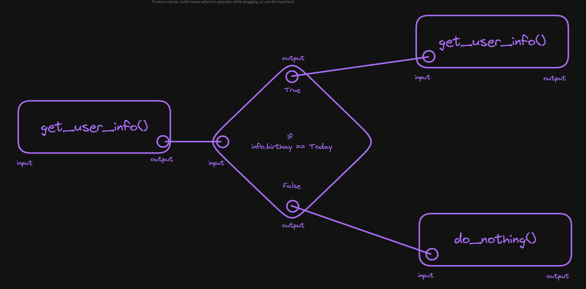
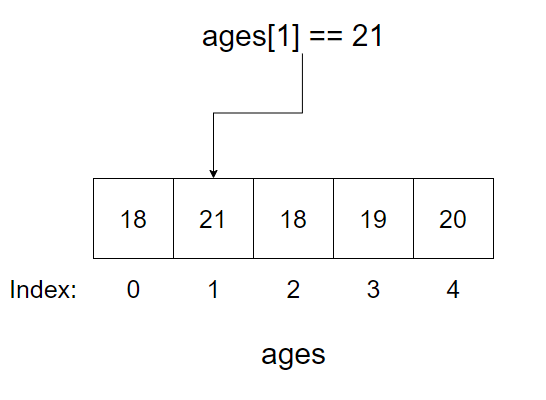
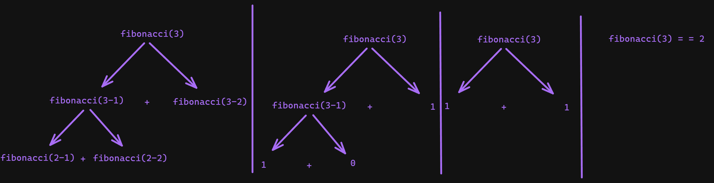

This section will talk about basic programming concepts, if you want the easiest way to start programming I would look into the [[Python]] section, which will detail how to use python for all these concepts. This section covers programming more holistically, and will be more difficult than just learning a language to start with. 
## Programming Languages
Computers communicate using electrical signals, these signals are then [[Abstraction (TODO)|abstracted]] into [[Binary, Hexadecimal and Number Systems#Binary|binary]]. This allows programmers to control these signals in easier to work with ways. Programming languages are built on top of layers and layers of existing [[OS & Firmware/Basics#Firmware/Bios|firmware]] and [[OS & Firmware/Basics|operating systems]]. Programming languages let you define programs (also called applications or binaries) that run in order to do something. Anything you run on your electronic devices today is the result of a programming language. 

### Markup vs Programming languages
Programming languages are Turing complete, this is a fancy name for meaning it can be used to do whatever you want. The intention with programming languages is to create programs/apps that do things. Markup languages instead define what should show up. For example the language that is used in PDF's or on webpages are markup languages. They don't actually do any processing, instead it tells the computer where to draw things on the screen that you want to show the user.

### Source Code, Binaries, and scripts
Source code are the actual files a programmer works with to create **binaries**. Binaries (not to be confused with [[Binary, Hexadecimal and Number Systems#Binary|binary]]) are software that can be run by a computer. The source code is essentially an easily readable set of instructions, which the computer then compiles (using a [[Compilers (TODO)|compiler]]) into "machine code", which is what the computer then actually runs. Binaries are also called:

- applications, or apps
- scripts
- executables or execs

### Pseudocode
For this section I will use Pseudocode, this is a fancy name for "I don't want to write real code". Essentially it will be a mix of code syntax and plain English to make it easy to read. It also lets me explain topics and syntax from multiple language at once.

### Compiled vs interpreted
There are various different types of languages. Compiled languages (like [go](https://go.dev/), [C](https://en.wikipedia.org/wiki/C_(programming_language)), [Rust](https://www.rust-lang.org/), etc.) require you to compile your code.  This process takes a few steps usually, and results in a binary that is pure machine code. This means once it's compiled any  similarly configured system can just run the binary. This means the flow of your development is:

1. Write source code
2. compile
3. Run the resulting binary

Typically compiled languages have the tradeoff of taking longer to be able to initially run your code, however they are typically also more optimized than the other option, which is interpreted languages. Interpreted languages ([Java](https://en.wikipedia.org/wiki/Java_(programming_language)), [python](http://python.org/) etc) instead allow you to compile your code into an intermediate language (or [[#Bytecode]]. From there if people have the language installed they can execute the intermediate language. This is usually faster than compiling to machine code because the language doesn't care about having to make sure **everything** necessary to run is included. Instead it just includes what is necessary for people to run who have the language installed already.

So for example if you write a go program and compile it for windows you can send the resulting executable to someone on windows running the same architecture, and it will work. If you instead write in Java then the result you send them can only be run in java, or you have to include the entire java runtime for them to be able to run it.  

Python takes this a step further where to run python code you actually can't compile it at all, to run python code you have to use the python binary, and it will then do the [[#Bytecode]] and machine code conversions on the fly for you when you run the program.

#### Runtime/environment
Your runtime/environment is the actual language that runs your code. For languages that compile to machine code there isn't really an environment after compiling. For languages that run in a [[#REPL]] or use [[#Bytecode]] a runtime is what actually executes the code you type in.
#### REPL
REPL (Read, Eval, Print, Loop) is a special way to execute code.  It is mostly used for testing, but it is possible to run full programs using it. REPL works by running your code line-by-line as you type them. For example each `>>>` would be a statement, and underneath is the printed result:

```
>>> x = 4
4
>>> x + 10
14
>>> x += 4
8
```

So as you can see the language **R**eads your code, **E**valuates it, **P**rints the relevant result, **L**oops to wait for the next input. This method is also available for **some** compiled languages, though typically through third party libraries (i.e. [gore for go](https://github.com/x-motemen/gore)).
#### Transpiling & Code Generation
A transpiler is a program that takes in code of one type and converts it to some other type of code. Sometimes the word is also used for transpiling [[#Markup vs Programming languages (TODO)|markup languages]]. Essentially we want to take some text and convert it to text that is useful for us. A transpiller specifically tends to do this using the same methods that [[Compilers (TODO)]] use. 

Code generation is instead a method of creating code based on some input. For example [ezcv]() is a program that takes in information about you and generates HTML/CSS/Javascript for it. Essentially because source code is just text, we just need some code to produce text for us. For example here is a code generator that takes in your name and would generate a python file to print it:

```
name = input("Type your name")

write_file(content="print({name})", filename="print_name.py")
```

This takes in your name from some sort of input, then writes a file called `print_name.py` with the source code `print(name)`.
#### Bytecode
  
Bytecode is a low-level, platform-independent representation of a program's source code that has been translated from a high-level programming language. Instead of being directly executable by a computer's hardware, bytecode serves as an intermediate step. You generate bytecode from source code and then the language runtime will actually run the code. It is typically generated by a compiler or an interpreter and consists of compact, binary instructions that are designed to be efficiently interpreted by a virtual machine specific to the programming language. 

Bytecode in theory allows for greater portability of software, as it can be executed on any system equipped with the appropriate virtual machine, providing a level of abstraction between the application and the underlying hardware architecture. For example let's say we have the code:

```
print("hello")
```

This code is easy to read and friendly, but if we were to put this code in python and get it's resulting bytecode (using [dis](https://docs.python.org/3/library/dis.html)), it looks like this:

```python
1           0 RESUME                   0

2           2 LOAD_GLOBAL              1 (NULL + print)
		 14 LOAD_FAST                0 (text)
		 16 PRECALL                  1
		 20 CALL                     1
		 30 POP_TOP
		 32 LOAD_CONST               0 (None)
		 34 RETURN_VALUE
```

This bytecode could be taken and run anywhere that supports python (though usually you just run python from it's source code, and don't even see this step). This code would then be [[#Transpiling & Code Generation (TODO)|transpilled]] into the machine code for your system. This can be handy for interoperability, and for optimizations that are cross-platform.
### Node-based
There is one other paradigm of languages that is newer that exists. Node-based languages are languages that use nodes to visually connect your data processing. Under the hood these are fancy [[#Transpiling (TODO)|transpillers]], whatever you create visually will generate some code, and then it will be processed however that language works. These nodes will each typically represent 1 function, and then will have ways of passing information between them. For example imagine a program where a function gets someone's name and birthdate, then sends that into another function which shows "happy birthday" if it's their birthday. The pseudocode might be:
```
info = get_user_info() // Returns some info

if info.birthday == Today:
	say_happy_birthday()
```
In a node-based language it might look something like this:



For example:
- [Node-RED](https://nodered.org/) 
- [scratch](https://scratch.mit.edu/) 
- [make code](https://www.microsoft.com/en-us/makecode)
- [dark lang](https://darklang.com/) 
- [Torq](https://torq.io/)
- [Power Automate](https://www.microsoft.com/en-us/power-platform/products/power-automate)
- [Tines](https://www.tines.com/)
## Comments
Comments are what they sound like, they don't do anything and they're there to let you add comments for yourself and other developers to read. This can be handy (especially when starting) to provide information that is not easily ascertainable by the code. A comment can be on it's own line, or "inline". inline comments will go after some code. Comments can also be single-line, or multiline. In the example below the comment character will be `//`, which means anything after `//` will be a comment. For example:

```
// This is a signle line comment

some_code // This is an inline comment
```
However there are various different comment characters that are used for example:

```
# This is jused in python, bash, YAML etc.
// This is used in C, Rust, Javascript etc.
-- This is used in SQL, Haskell etc.
<!-- This is used in HTML, XML etc. -->
; This is a comment in assembly, etc.
! This is a comment in FORTRAN, etc.
% This is a single line comment in Erlang, LaTeX, etc.
```
And multiline comments can be different:
```
"""This is a multiline comment in
	- python
"""
/* This is a multine comment in
	- C
	- Rust
	- Javascript
	- CSS
	- etc.
*/
{-- This is a multiline comment in
	- Haskell
--}

```
For my pseudocode I will use `//` for comments and `/* */` for multiline comments.
## Variables
When working with code you will inevitably want to store some information. To store information we use variables. Variables are basically labels we can use to refer to information more easily. Different languages have different rules about how to create variables, and how to use them, but every language has variables in some form.

### Assignment and initialization
When you want to use a variable you need to create it. The simplest form of this in many programming languages is to put the label (variable name) on the left, and then an = and then the value. For example:

```
name = kieran
```
You  can then typically reference this later in the file using the label. For example here might be some math:

```
x = 4
y = 3

z = x + y // z is 7
```


### Mutability
Mutability is the concept that you can change variables. Some types of data you store are able to be mutated so that their content can be changed, others cannot. If a variable cannot be changed it is called an immutable variable. For example here is a mutable variable:

```
x = 4

x = 5
```

In some languages (like rust) values are immutable by default and you have to specify **mutable** values.
```
mut x = 5 // x can be mutated

y = 5 // y is immutable
```


#### Constants and immutable values
Constants exist in some languages, constants cannot be updated regardless of the type used. These are good for things that don't change (like the value of PI, or the [gravitational constant](https://en.wikipedia.org/wiki/Gravitational_constant)). Most languages your variables are **mutable**. In these languages you can sometimes specify variables as immutable with constants, or other language constructs like [readonly](https://basarat.gitbook.io/typescript/type-system/readonly):
```
readonly x = 5

const PI = 3.14159
```
### Scoping
Variables don’t exist forever. If they did then long running programs would be very inefficient. What programming languages do instead is they scope variables, so they get deleted when they’re no longer needed. The scoping rules, and how they apply differ by language.

This also helps to avoid some common issues that might come up with variables. For example lets say you have some code that uses the variable name then later you have some code that also uses name. In this case whichever one comes last would override the other. However if they are in different scopes, then they can be used independent of one another. Often for example you can have a program where `name` is used in one file, and `name` is used in another file, but since the variables are scoped to each file they don't conflict. For example:

```
file1.name // Kieran

file2.name // Jamie
```
In this case code in file1 will get `Kieran` when they use `name` and `file2` would get `Jamie` when they use `name`. Scoping is also heavily tied to [[#Conditionals]] , and [[#Functions]].
### Data Types

Not all data is formatted the same. Data types are the basic building blocks that let you define what data looks like. It gives information about what you're trying to store and effects performance, and what information you can put in a variable
#### Dynamic vs Strict Typing
Dynamic languages will allow you to create variables without stating a data type explicitly, instead they are **inferred**, for example:

```
x = 4
y = 3

z = x + y // z is 7
```
In this case the type of the data is **inferred** meaning when x is assigned to 4 it's inferred to be an [[#Integer]]. In other languages you have to explicitly state the data type. If you have to state the type it's referred to as **static typed**, whereas ones without needing to specify the type are called **dynamic typed** (or **duck typed** sometimes). For static languages, this is an example of how you define a variable:

```
// type label = value
int x = 4 // Rust, C and other languages use this format

// label:type = value
x:int = 4 // Typescript and others use this format
```

Some languages can let you specify when you want to **infer** vs be strict. For example in go `:=` means assign a variable and infer it's type:
```
// Explicit typing
int x = 4

// Inferred tpye
x:= 4
```
Some languages will also allow you to declare a variable without a value, which can be initialized with a value later. For example:
```
int x

x = 4
```


#### Primitive vs Derived types

Primitive types are data types that are included by default in most languages. They are the **essential** data types used to build programs. Every type we cover in this section will be a **primitive type**. A derived type is a type that is programmer created and not part of the language. You can create these using [[Advanced Data Structures (TODO)#Class|classes]]/[[Advanced Data Structures (TODO)#Struct|structs]]/[[Advanced Data Structures (TODO)#Enumerator|enums]].
#### Integer
Integers are normal whole numbers (no decimals). So for example here are some integers:

```
x = 5
y = 32
z = -256
q = 0
```
In many languages you will find integers being referred to as `int`. 
##### Sizing
Integers are often split up by sizes. This can help massively with optimization, but can make things more complicated. In languages that specify them usually there will be an `i` with a number. This number will typically indicate the [[Binary, Hexadecimal and Number Systems#Binary|bits]]:

| Symbol | Description | Min and Max |
| ---- | ---- | ---- |
| i8 | 8 bit integer (1 byte) | -128 to 127 |
| i16 | 16 bit integer | -32,768 to 32,767 |
| i32 | 32 bit integer | -2,147,483,648 to 2,147,483,647  |
In some languages they instead have `short`, `long`, `long long` and other shorthands for integers. You would need to lookup the specifics in each language to find these, but typically they will correspond to a number that has a certain number of bits.
##### Signed vs Unsigned
An unsigned integer is an integer that can **only be positive**. A signed integer is an integer that can be  **positive or negative**. In many programming languages you will see an unsigned integer as starting with `U`:

| Symbol | Description | Min and Max |
| ---- | ---- | ---- |
| u8 | 8 bit integer (1 byte) | 0 to 255 |
| u16 | 16 bit integer | 0 to 65,535 |
| u32 | 32 bit integer | 0 to 4,294,967,295  |
As you can see compared to the signed integers above, unsigned integers can hold larger numbers for the same number of bits.
#### Float/Floating Point
Floats (floating point numbers) are decimal numbers. This includes positive **and** negative numbers. One important thing to keep in mind while working with floats is that every language has a limited precision ([whole site dedicated to this](https://0.30000000000000004.com/)). This means it will only be accurate to a certain number of digits. There are also common rounding errors, like the famous `0.1+0.2 == 0.30000000000000004`.
#### Collections
Collections are a data type that is used to hold multiple other data types. For example lets say you wanted to keep track of all of the names of items in a player inventory. You could put them into a collection to keep track of all of them in one variable, instead of a separate variable for each item! There are tons of different types of collections, some of the names are not always exactly the same across languages, so keep that in mind when looking at this info!

##### Lists

Lists are a dynamic collection. They basically let you add as much (besides memory constraints) data as you want. In strongly typed languages (ones where you have to specify types), they can only have 1 data type, in most other languages they can take whatever data you want. Here is an example of what it might look like in a **non-strongly typed language**:

```ini
ages = [18,21,18,19,20]
```

This gives you a list where


You can then access the element using it’s _index_. The index is essentially the number that indicates where in the list a value is (starting from 0). You can access this using `ages[index]`. So if you wanted to access the **second** element you could use `ages[1]` (which in this case would be 21):



Traditionally lists will have methods to add, remove, and pop. Add and remove are self explanatory, but pop is probably a new idea. Pop will run and it will  delete an item from the front of a list and then return that value. 
##### Arrays

Arrays are one of the most basic collection types. These are typically quite restrictive, but very fast. You will have to specify the length of an array as well as the types it will contain.

So for example if you want to store the ages of 5 people as integers you might do something like this:

```
ages[5]<Int> = [18,21,18,19,20]
```

This gives you an array where:


You can then access the element using it’s _index_. The index is essentially the number that indicates where in the list a value is (starting from 0). You can access this using `ages[index]`. So if you wanted to access the **second** element you could use `ages[1]` (which in this case would be 21):


This data type can be different in different languages, Arrays in JavaScript are actually [[#Lists]] for example.
##### Sets

Sets are collections that require **unique** items. This is implemented different ways in different languages, but for example:

```
words = set("hello", "oranges", "hello", "great")
print(words) // ["hello", "oranges", "great"]
```

Even though “hello” was given twice it only appears once. This makes sets great for checking if something exists. Imagine you are searching through a book, and want to check if the book has the word “disparate” in it. Now lets say there are 900 times the word “the” appears. To search all the words you have to search through all 900 repeats of “the”, but with a set there’s only 1 occurrence of "the".

##### Tuple's

Tuples are similar to [[#Lists|lists]], except once the values have been added they can’t be changed (it’s immutable). So you can’t add items to a tuple, it’s stuck how it is. This can be handy for data you don’t want to let be modified. For example someone’s birthday:

```
birthday = ('oct', 29, 1998) 
birthday[2] += 1 # ERROR
```

You don’t want to accidentally have someone add something to the birthday because the data doesn’t change! This is often used in databases since the data being returned should be considered read-only, and copied into something mutable if people want to make changes.

##### Associative Arrays/Maps/JSON/Dictionaries

These are the first collection that does not use indexes for it’s elements. All of these are different names for what are called key-value stores. Instead of using indexes you can set your own ‘key’, which maps to a value. This lets you represent abstract data with it’s own labels easily. For example information about a user:

```
user = {"name": "Kieran", "age":24, "developer":true} 

user["name"] # "Kieran"
```

Under the hood this uses [[Hashing]] to be more efficient. Additionally a blog post about creating these data structures from scratch can be found [here](https://kieranwood.ca/tech/blog/verifying-quickly/).

#### Text types
There are several ways to represent text in most programming languages based on what you need.
##### Char

A char is a single character. In many languages this type is actually an integer under the hood. There will be a list where each character has a number corresponding to it and you can convert back and forth between them. For example in python you can see this text-number conversion with the `ord()` and `chr()` functions:

```python
ord("a") # 97 chr(97) # 'a'
```

Other languages like C you can just convert characters to integers and back natively:

```C
char a = 'a';

int numericalA = (int)a; // Returns ASCII value of 'a'
```

In some languages Char's and [[#String]]'s are differentiated with `'` and `"`, but in others this is not the case.
##### String

Strings are what we think of as normal text. They allow for the storage of text, in some languages this can be text of any length, in others it’s a fixed-length amount of text. In some languages strings consist of [[Programming/Basics#Arrays|Basics]] of [[#Char]]’s, in other’s they’re their own custom type. For example you could consider "hello" to be either of the below:

```
['H','e','l','l','o']

"Hello"
```

Whichever you choose in many languages they're still treated as an [[#Arrays|array-like]] data type. This allows you do [[#Loops (TODO)|loop]] over characters to do processing.
##### Whitespace Characters

In strings there are often times where you need to include some sort of whitespace. For example this might be inserting a newline character in order to simulate pressing the enter key in most text editors (`\n`), or a character to indicate the same effect as pressing tab (`\t`). These are called whitespace characters. They tend to be pretty universal.

For example:

```
 greeting = "Hello there!\nMy name is Kieran. Here are my favourite hobbies\n\t- Skiing\n\t- Coding"
```

This would result in:

```markdown
Hello there!
My name is Kieran. Here are my favourite hobbies
	- Skiing    
	- Coding
```

##### Formatting

With strings in most languages there are various ways of doing formatting. Formatting allows you to inject data into strings. This is incredibly powerful, but can also [[Types of attacks (TODO)#Cross-site Scripting (TODO)|be very dangerous]]. 

For example let’s say you want to have a template email where the variables for recipient (person receiving email) and sender. In python you can put an `f` in front of a string to turn it into a “format string”, from there you put the variables inside squiggly braces (`{}`), and they will be replaced by the values:

```python
sender = "Kieran" 
recipient = "you" 

email = f"""Hello {recipient},

We appreciate you reaching out, we are not open on the weekend and will re-open on monday at 9am to address your email. 

Thanks,
{sender}"""
```

The same can be done in javascript with strings that use a backtick (\`), then stating which should be replaced by variables using squigly braces that have a `$` in front:

```js
sender = "Kieran" 
recipient = "you" 

email = `Hello ${recipient}, 

We appreciate you reaching out, we are not open on the weekend and will re-open on monday at 9am to address your email. 

Thanks,
${sender}`
```


##### Encoding

Text under the hood is represented as numbers for each character, there are then different sets of numbers that allow for different sets of characters. These are called the encodings. Different systems use different encodings in order to allow different characters.

For example ASCII is a very simple encoding that allows 127 different characters. In ASCII ‘a’ would be 97. Unicode is a set of different encodings that allow for a lot more characters. UTF-8 allows 1,112,064 characters, in our example case ‘a’ would still be 97, but this is not the case in every encoding. Also because UTF-8 supports more characters you have to be careful with conversions. Japanese characters work in UTF-8 for example, but **not** ASCII.

We have a page dedicated to [[Encodings|encodings here]].

#### Booleans
Booleans are values that indicate if something is `true` or `false`. These can be used in conjunction with [[#Conditionals]] to tell a program what to do.


A trivial example would be the current season:
```
is_summer = False
is_winter = False
is_fall = False
is_spring = True
```

Based on this the program might use a [[#Conditionals (TODO) |conditional ]] to show a certain theme based on the current season. This can also be used for things like user settings:

```
dark_theme = true
```

In some languages (like C & python) booleans are actually just integers. For example here are the various representations of true and false in different languages:

```
// True
true
Yes
1
TRUE
True

// False
false
No
0
FALSE
False
```

##### Boolean Logic
Logical operators can be used to make a series of statements and only let them be true based on which operator is used. Traditionally this uses [[#Booleans]], which can also take the form of an [[#Integer]] in languages like C and python. Here are the Boolean logic operators:

| Name | What it means | Code | Symbols |
| ---- | ---- | ---- | ---- |
| AND | If both values are true, the result is true, otherwise False | <br>`true && true // True`<br><br>`true && false // False`<br><br>`false && true // False`<br><br>`false && false // False`<br> | `&&`, `and`, `AND` |
| OR | If one value is true, the result is true, otherwise false | `true \|\| true // True`<br><br>`true \|\| false // True`<br><br>`false \|\| true // True`<br><br>`false \|\| false // False` | `\|\|`, `or`, `OR` |
| NOT | Invert the operation (true is false and false is true) | `!true // False`<br><br>`!false // True` | `!`, `NOT`, `not`, |
| XOR | If the values are opposite then true, else false, this is a [[Binary, Hexadecimal and Number Systems|binary/bitwise]] operation meaning it's based on 0's and 1's in binary | <br>`True ^ True // False`<br><br>`True ^ False // True`<br><br>`False ^ False // False`<br> | `^`, `XOR`, `xor` |


This sort of logic is fundamental for [[Binary, Hexadecimal and Number Systems#Operations in Binary|binary operations]], [[Logic Gates (TODO)]] and much more.
##### Comparison Operators

Comparison operators return a boolean value after comparing two values to see if a statement is True or False

|Name|Description|Python|JS|
|---|---|---|---|
|Greater|Checks if something is greater than something else|`1 < 3 # True`|`1 < 3`|
|less|Checks if something is less than something else|`3 > 1 # True`|`3 > 1 // true`|
|Greater than or equal to|Checks if something is greater than or equal tp something else|`1 <= 3 # True`|`1 <= 3`|
|Less than or equal to|Checks if something is Less than or equal tp something else|`3 => 1 # True`|`3 => 1`|
##### Truthyness
In many languages you can do checks against values of other data types to see how "truthy" they are. This is usually done to indicate if a value is "empty" or not. For example:

```
"" // Would be false because it's an empty string
0  // Would be false because it's 0
[] // Would be false because it's empty
```

##### Referential

A referential check is done to see if a variable is exactly the same object as another variable. So not just that the value is the same, but that the two variables are actually talking about **the exact same** spot in memory. In this case we will use `is` as the keyword for a referential check:

```
a = [1,2,3]
b = a
c = [1,2,3] 

a == b // True
b == c // True
a == c // True 

a is b // True
b is c // False
```

##### Value and Type

In some languages when you are checking a value the value itself will be derived from different types. For example :

```
1 == True // True
0 == False // True
```

In this case True gets converted to an integer (1) in this case, which we then check for equality and the equality is now true. Sometimes with some languages this goes further like:

```
"1" == 1 // True
```

In some languages we have an option to equality check while forcing a specific type to be checked. We do this by adding an extra `=` to our checks (called a strict comparison):

```

"1" === 1 // False

```


#### Null, None & undefined types
Many programming languages have some sort of "Null" value. These values can be called different things, but they essentially are there to state nothing. This may seem entirely useless at first, after all who would want to reference nothing in their programs? Well, it's actually very useful for a few reasons. Typically most people use Null as an initialization state. For example you want to create a variable you intend to use later, but have no value to put in it yet. This can be handy because it means that other programs that might use that variable can just check every so often if the value is still Null as a way to wait for it to become initialized. 

It's also useful to do this for space savings. Unlike other placeholder values most Null's take up basically no space (in some languages literally no space). This means you can save all that space in memory until you actually need it. 
#### Pointers
A pointer is a way to specify a variable that "points" to another value. This is important for languages that aren't [[RAM|memory]] managed (like C). In languages that allow pointers you can specify an [[Binary, Hexadecimal and Number Systems#Addressing|address]] that a pointer references. Whatever is available at that address can be manipulated as if it was the variable. For example:

```
a = 5

b = *a

b = b - 3

print(a) // 2
```

This allows you to share state as we can see above where we set `b = *a`, which is saying that b is a pointer to `a` and so any changes to `b` will affect `a`. This is also used under the hood in all other languages, but many languages (like python) don't allow you to directly modify these pointers. 
## Conditionals
In programming we don’t always want to execute the same code. Sometimes we want to execute code based on something. We might want to check if someone has a premium account before allowing them to access a song, or check if they’re in a certain country etc. Conditionals are the way we do these checks, which allow us to conditionally run code based on some sort of check.

Under the hood these checks operate based off [[#Booleans]]. All of the operations done will evaluate to a True or False value which can be checked against.

### If/Else/ Elif or Else if

The main statement used for conditionals is the `if` statement. This statement is made up of two parts, the condition and the body. The body will only execute if the condition is True. For example the `print()` will always execute:

```
if True{
	print("True!")
}
```

In this case `print("True!")` is the condition body it is wrapped in `{}` to indicate what should run if it's True. For example if we nest some statements:

```
if premium{
	if isAdult{
		print("A premium Adult")
	} else {
		print("Just is premium")
	}
}
```

In this case if `premium` AND `isAdult` then we get `A premium Adult` printed.  You can see that each set of `{}` corresponds to a different condition, and will only run if that condition is true. This is called a **scope**. In some languages scopes are instead defined by indentation, like python:

```python
if premium:
	if isAdult:
		print("A premium Adult")
	else:
		print("Just is premium")
```

In this case each level of indentation is a separate scope. From here you can create **control flows**, which are statements that allow for multiple _branches_ of code where one branch will activate based on a condition. For example code in python that changes based on the current season:

```
isSummer = false
isWinter = false
isFall = false
isSpring = true
 
if (is_summer){
    print("It's warm")
} else if (is_spring){
    print("It's raining")
} else if (is_fall){
    print("It's getting colder")
}else{ 
    //Assumes isWinter is true
    print("It's snowing!")
 
} 
```

Some languages also combine the keywork `else if` into the abbreviated `elif`.
## Functions
Functions are a way to reuse code efficiently. It allows you to define a set of steps of code that should be run when the function is “called”, along with a name.
### Using existing functions

Using (or “calling”) existing functions works the same in **most** languages. You find whatever the name of the function is, and you type `function_name()`, some functions take in extra data (called [parameters](https://schulichignite.com/definitions/functions/#parameters)), so you can “pass” the function this data when you call it.

For example here is how you print some text to the screen in using a `print()` function:

```
print("Hello World")
```
In this case we are using a [[#String]] parameter to tell the function what to print. However there are many times that our functions take in no values, in these cases the functions effects are called side-effects. For example, let's say we have a function to restart a computer called `restart()`:

```
restart()
```

We have no parameters to pass in because we just want it to effect something else that exists.
### Anatomy of functions
To create a function there are several parts you need, all of the parts work to define what the function does, and how it does it. These parts are:

1. The definition
2. The body

Within each part there are several sub-parts to consider as well.

#### Function Definition

This is where you define the function name (and optionally [[#Parameters]]). To define a function you will need to use the definition keyword in whatever language you are writing, and you will need to provide a name.

For example let's say `func` is the definition keyword. So if we were to define a function that will tell you what the weather is today called `todays_weather` we could do it like this:

```
func todays_weather(){
  // This is where the function body will go
}    
```


##### Naming conventions

Languages will have different naming conventions. You **don’t have to follow these**, but it’s recommended. In python, rust and some others functions are usually “snake case”, this means the names are all lowercase, and you separate words with “\_”. For example first name might become `first_name`.

Javascript, Java and others typically uses camelCase, instead of separating different words you just capitalize the first letter. So for first name it would become `firstName`. This changes nothing about the code that is run with a function, it’s just a convention people follow in languages to standardize how code looks.

##### Parameters

Parameters are data you can pass to a function in order to be able to re-use code more effectively. For example you might specify a `name` parameter that is used to pass the user’s name to a function. Imagine we have a function called `greeting()` that takes this name parameter, it might look like this in python:

```python
def greeting(name):    
	# Function body here
```

and like this in javascript

```js
function greeting(name){    
	// function body here
}
```

##### Multiple parameters

You can specify multiple parameters for functions, in most languages you can do this with a comma seperated list of names for the parameters. For example a function `game_over()` that takes in a winner and loser parameter. First in python:

```python
def game_over(winner, loser):    
	# Function body here
```

Now in javascript a `gameOver()` function with the same parameters:

```js
function gameOver(winner, loser){    
	// Function body here
}
```

##### Default and optional values for parameters

You can also specify parameters that have default values. This can be used to make common situations your functions will be run under easier, but also can be used to make some parameters optional if the value is still the default when run. Here is a function `feedback_form_submission()` that takes in data from when someone fills out a form in an app, it takes in the email of the user, and optionally a comment variable:

```python
def feedback_form_submission(name, comment=""):    
	# function body here 
	
# Can now call the function with a comment
feedback_form_submission("John Doe", "What an awful event") 

# Or call it without a comment
feedback_form_submission("Kieran")
```

In python these are also called keyword arguments (kwargs for short). In javascript it would look like this

```js
function feedback_form_submission(name, comment=""){    
	// function body here
} 
// Can now call the function with a comment
feedback_form_submission("John Doe", "What an awful event") 

// Or call it without a comment
feedback_form_submission("Kieran")
```

##### Typed vs Untyped

There are different types of languages, strongly and weakly typed. Strongly typed languages require you to tell the language what the types of each parameter are (integer, string, list etc.). Javascript and python are weakly typed languages, so this isn’t **required**, but python does offer type hinting, which can be useful in ambiguous situations. If you have never heard of [type hints](https://docs.python.org/3/library/typing.html), they are used to define what data type each of the variables/attributes should be. For example a string variable called name would look like this:

```python
name:str
```

And if the variable can more than one type you have the first type on one side of a | and then the other option for the type. So `str | None` would mean the variable could be a string, or a `None` like this:

```python
name: str|None
```

We could then apply this to our parameters like this:

```python
def feedback_form_submission(name:str, comment:str=""):    
	# function body here
```

#### Function Body

This is where you define the code that should be run when someone calls a function. This is defined by some sort of _scope identifier_. These scope identifiers change per language, but there are two common ones.

##### Indentation

The indentation level of the code is used to identify the scope in several languages. For example in python let’s define a function called `greet_person()` which takes in a name parameter which is a string and uses it to greet them:

```python
def greet_person(name:str):    
	# Function body starts here    
	print("Hello there")    
	print(name)    # And ends here
```

##### Squiglies

Squiflies (not the actual name) are often used as scope identifiers in languages. For example in javascript you define where a function starts and stops with everything inside squigglies ({}), so a function starts at `{` and ends at `}`. Here is an example of a function that takes in a name, prints a greeting, then the name:

```js
function greetPerson(name){    
	console.log("Good morning")    
	console.log(name)
}
```

This means when someone calls `greetPerson("kieran")` only the two `console.log()` statements will run!

#### Returning

For some functions you will want to return a resulting value. The easiest example of this is returning a number from an addition function:

```python
def add(x, y):    
	return x + y
```

or in js

```js
function add(x, y){    
	return x + y
}
```

#### Type hinting returns

You can type hint your returns the same as you can with your parameters in python. You simply add a little arrow `->` before you start the function:

```python
def add(x:int, y:int)->int:    return x + y
```

This tells people what to expect when they retrieve the value of a function and store it in a variable
### Recursion
Recursion is the technique of running a function within a function definition. This can be used to solve problems. For example the Fibonacci sequence can be generated using:

```
func fibonacci(n){
	if n == 0{
		return 0
	} if n == 1{
		return 1
	}
	return fibonacci(n-1) + fibonacci(n-2)
}
```

So let's step through what happens if we were to provide `n=3`:

```
fibonacci(3):
  1. Return fibonacci(3-1) + fibonacci(3-2)
  2. Do the left first fibonacci(3-1):
	  1. fibonacci(2)
		  1. return fibonacci(2-1) + fibonacci(2-2)
		  2. Do the left first fibonacci(2-1)
			  1. returns 1
		  3. Do the right
			  1. Returns 0
		  4. 1 + 0 = 1
  3. Do the right
	  1. fibonacci(3-2)
		  1. returns 1
  4. return 1 + 1

fibonacci(3) == 2
```



To create a recursive function we need:
1. Base case(s); When the function stops making recursive calls to itself. If we don't have this it will recurse infinitely
2. The recursive case(s); When the function should make the recursive calls

Here is the fibonacci function annotated with comments to indicate the base and recursive cases:

```
func fibonacci(n){
	// 1. Base case(s)
	if n == 0{   // Base case 1
		return 0
	} if n == 1{ // Base case 2
		return 1
	}

	// 2. Recursive case
	return fibonacci(n-1) + fibonacci(n-2)
}
```

### Effect on scopes

As mentioned earlier functions have an impact on [[#Scoping]]. For example there's a separate scope inside a function:

```
x = 5

function doStuff(){
	x = 3
	// x is 3
}
// x is 5

```
Some languages will allow you to modify values in outer scopes, and in those cases x would be 3. But in most languages x would be 5 at the second comment. Look into the language specifics of your language to understand this.
## Loops
Loops are a concept in programming that allows you to run some code for a defined number of times. This means if you have an operation you want to run 1000 times, or maybe run some code for every user in a database, or show a menu until someone makes a choice in a game, loops are what you want.

### Parts of a loop

Loops have two main parts, the loop definition, and the loop body. The loop definition defines how long the loop should run for, and/or what data is available inside the loop. The loop body defines what runs inside the loop. There are two popular ways this is done in languages, indentation or squiggly braces:

*Not real code

```rust
loop definition:    
	loop body 

loop definition{    
	loop body
}
```

In the first (used by languages like python) everything that is indented will run for each [[#Iteration]] of the loop, in the second everything inside the {} will run.
### Iteration
Iterators is the name given to types of data that are designed to be looped over. For example if you have some text then in most languages that will be an iterator where you will start at the first letter and be able to loop through each letter one at a time.

You can also usually create your own iterators so that for example if you have some code generating a slideshow you could create an iterator that loops through each slide. The only thing that matters is that you can define a start, an end, and some way to get from one item to another (sometimes items in iterators are called elements).
### Iterators

Iterators is the name given to types of data that are designed to be looped over. More details can be found [[Advanced Data Structures (TODO)#Iterators (TODO)|here]]. 

### loop Types

There are several different types of loops that exist and are used in different situations. Most problems you run into can be approached with more than one option, so pick which one you think works best for you. 

##### For

For loops run for a length of time defined by what you are trying to loop over. There is a section below that explains when to use each!


###### C-style

C-Style for loops are what most languages call for loops. They will allow you to define a variable that starts at some value, define an end condition and then loop until the variable equals that condition. Below is an idea of how this might work:

\*Not real code
```
index = 0

for index until index is 10:
    print("Hello")
    index += 1

```

In the above example index starts at 0, on each [iteration](#iteration) it will print hello, and then the index has 1 added to it. The loop runs until the index variable is 10 which is when the loop ends. 

This can be done in python like so:

```python
for index in range(10):
    # Python automatically starts at 0 
    # & adds 1 to index per itteration
    print("hello")
```

or Javascript like so:

```javascript
for (let index = 0; index < 10; index++) {
    console.log("hello");
}
```

###### Foreach

For each loops are a bit different than regular for loops. In a regular for loop you will use integers (numbers) to control how the loop works. Whereas a foreach loop will loop over each item/element in an [iterator](#iterators). 

For example lets say you have a shopping list, and want to print each item in the shopping list, you can do something like this:

\*Not real code
```
shopping_list = ["eggs", "ham", "spam"]
foreach item in shopping_list:
    print(item)
```

This loop would print "eggs", then "ham", then "spam". By default python is one of the only languages that uses foreach as it's for loop. So here is the above example in python:

```python
shopping_list = ["eggs", "ham", "spam"]
for item in shopping_list:
    print(item)
```

When you use the `range()` function in python it actually just generates a list to loop over with a foreach loop. So these two would be the same:

```python
for index in range(10):
    print(index)

for index in [0,1,2,3,4,5,6,7,8,9]:
    print(index)
```

foreach is implemented differently in different languages. Javascript for example runs the loop directly on the data you want to loop over:


```javascript
shopping_list = ["eggs", "ham", "spam"]

shopping_list.forEach(item => {
    // This would be your "loop body"
    console.log(item)
});
```

###### When to use each

Both of these two for loops have advantages and disadvantages. But here are some rules of thumb

**C-style**: If you want to make modifications to items, just want to use numbers or foreach isn't available

**foreach**: If you want to **only read** data. **Some** data types will let you make modifications in foreach loops, but not all of them and not in every language. If you have a list of numbers for example and you add 1 to it, then that change won't save in a lot of languages. Here's a python example:

```python
numbers = [0,1,2,3,4,5,6,7,8]

for number in numbers:
    number += 1

print(numbers) # still [0,1,2,3,4,5,6,7,8]
```

For this to work you would need a c-style loop:

```python
numbers = [0,1,2,3,4,5,6,7,8]

length_numbers = len(numbers)

for index in range(length_numbers):
    numbers[index]  += 1

print(numbers) # now [1, 2, 3, 4, 5, 6, 7, 8, 9]
```

##### while

while loops are used to run until a certain condition is met. They basically run until whatever condition specified is **true**. So for example this might be a while loop that would run 10 times:

\*Not real code
```
number = 0

while number < 10:
    number += 1
```

In this case the loop would run 10 times, then on the 10th run `number` would be 10 and `number<10` would be false, which would end the loop. This can be useful for tons of things, but the most common is game loops and menus. In games you can have something like:

\*Not real code
```
game_over = false

while not game_over:
    play_game()
```

Which would run until the game_over variable is set to true (perhaps when a player dies). This can be done with menus as well to wait for someone to select something, or anything that can be controlled with a boolean!

Here are the above examples in python:

```python
number = 0

while number < 10:
    number += 1

game_over = False

while not game_over:
    play_game()
```

and in javascript:

```javascript
number = 0

while (number < 10){
    number += 1
}

game_over = false

while (!game_over){
    play_game()
}
```

#### Infinite loops

You need to make sure your while loop **can** end. Most programming languages will not stop you from making a loop that never ends!

### loops and collections

These sorts of loops can be very handy when used with [[#Collections]]. Since collections take multiple steps if you want to run code on everything in them they are a perfect candidate for loops!

#### For loops

Let's say for example someone updated their difficulty in a game so you want to increase enemy HP, you could do something like this:

\*Not real code
```
index = 0

enemies = [enemy_1, enemy_2, enemny_3]

for index until index is length(enemies):
    increase_hp(enemies[index])
```

When accessing values in a list/array (`enemies`) you can access each item by it's index. So in this case `enemies[0]` would give you `enemy_1`. Since we start at 0 (all arrays/lists do) and then go until the index is the length of the list, we go through each element and run `increase_hp()` on it. So these two are the same:

\*Not real code
```
increase_hp(enemies[0])
increase_hp(enemy_1)
```

Here is the same example in python:

```python
enemies = [enemy_1, enemy_2, enemy_3]

length_of_enemies = len(enemies)

for index in range(length_of_enemies):
    increase_hp(enemies[index])
```

and in Javascript:

```javascript
enemies = [enemy_1, enemy_2, enemy_3];

lengthOfEnemies = enemies.length;

for (let index = 0; index < lengthOfEnemies; index++) {
    increase_hp(enemies[index]);
}
```

#### While loops

Let's say for example someone updated their difficulty in a game so you want to increase enemy HP, you could do something like this:


```
index = 0

enemies = [enemy_1, enemy_2, enemny_3]

while index < length(enemies):
    increase_hp(enemies[index])
    index += 1
```

When accessing values in a list/array (`enemies`) you can access each item by it's index. So in this case `enemies[0]` would give you `enemy_1`. Since we start at 0 (all arrays/lists do) and then go until the index is the length of the list, we go through each element and run `increase_hp()` on it. So these two are the same:


```
increase_hp(enemies[0])
increase_hp(enemy_1)
```

Here is the same example in python:

```python
enemies = [enemy_1, enemy_2, enemy_3]

length_of_enemies = len(enemies)

index = 0

while (index < length_of_enemies):
    increase_hp(enemies[index])
    index += 1
```

and in Javascript:

```javascript
enemies = [enemy_1, enemy_2, enemy_3];

lengthOfEnemies = enemies.length;

index = 0

while (index < lengthOfEnemies) {
    increase_hp(enemies[index]);
    index += 1;
}
```

### Other aspects of loops

Sometimes you want more manual control over a loop. For example let's say you want to end a loop early, or skip an item if some condition is true. There are built in options to most languages to do this.

#### break

Break can be used to end a loop early. This can be useful if you are looping over something, and want to allow the loop to stop running if the word "stop" is encountered:

```
foreach word in words:
    if word == "stop":
        break
```

This would break out of the loop when stop is encountered **or** when it reaches the end of the list if stop isn't there. 

Here is an example in python:

```python
for word in words:
    if word == "stop":
        break
```

and in javascript

```javascript
words.forEach(word => {
    if (word == "stop"){
        break
    }
});
```

#### continue

continue can be used to "skip" an iteration. For example lets say you want to add 1 to a number if it is even. You could do something like this to skip odd numbers:

```
numbers = [1,2,3,4,5,6]
length_of_numbers = numbers.length

index = 0

for index until index is length_of_numbers:
    if isOdd(numbers[index]):
        continue
    else:
        numbers[index] += 1
```

Here is an example of this in python:


```python
numbers = [1,2,3,4,5,6]
length_of_numbers = len(numbers)

for index in range(length_of_numbers):
    if not (numbers[index]%2==0): # Is odd number
        continue
    else:
        numbers[index] +=1
```

and in javascript:

```javascript
numbers = [1,2,3,4,5,6]
length_of_numbers = numbers.length

for (let index = 0; index < length_of_numbers; index++) {
    if (!(numbers[index]%2)==0){
        continue
    } else{
        numbers[index] +=1
    }
}
```

## Additional Resources
- Programming Languages
	- [What is a Programming Language (youtube.com)](https://www.youtube.com/watch?v=iqOYf4RFnMY)
	- [What is Programming? (youtube.com)](https://www.youtube.com/watch?v=6YMec72CEiU)
	- Markup Languages
		- Markdown
			- [Markdown Guide](https://www.markdownguide.org/)
			- [Markdown - Wikipedia](https://en.wikipedia.org/wiki/Markdown)
		- Open Document Format (odf)
			- [Office apps now support OpenDocument format 1.3 (microsoft365.com)](https://insider.microsoft365.com/en-us/blog/office-apps-now-support-opendocument-format-odf-1-3)
			- [Learn about file formats - Microsoft Support](https://support.microsoft.com/en-us/office/learn-about-file-formats-56dc3b55-7681-402e-a727-c59fa0884b30)
			- [OpenDocument - Wikipedia](https://en.wikipedia.org/wiki/OpenDocument)
		- XML
			- [What is XML? - XML File Explained - AWS (amazon.com)](https://aws.amazon.com/what-is/xml/#:~:text=Extensible%20Markup%20Language%20(XML)%20lets,%2C%20and%20third%2Dparty%20applications.)
			- [XML - Wikipedia](https://en.wikipedia.org/wiki/XML)
			- [XML Introduction (w3schools.com)](https://www.w3schools.com/xml/xml_whatis.asp)
		- Latex
			- [LaTeX - A document preparation system (latex-project.org)](https://www.latex-project.org/)
			- [LaTeX - Wikipedia](https://en.wikipedia.org/wiki/LaTeX)
			- [Learn LaTeX in 30 minutes - Overleaf, Online LaTeX Editor](https://www.overleaf.com/learn/latex/Learn_LaTeX_in_30_minutes)
	- Bytecode
		- [What is a Bytecode and Machine Code? (youtube.com)](https://www.youtube.com/watch?v=-am6IGpM9CU)
		- [What is Bytecode? Explain Bytecode, Define Bytecode, Meaning of Bytecode (youtube.com)](https://www.youtube.com/watch?v=MfTS9u57c3I)
		- [Python Bytecode: An Introductory Tutorial (youtube.com)](https://www.youtube.com/watch?v=mE0oR9NQefw)
		- [Java Bytecode Crash Course (youtube.com)](https://www.youtube.com/watch?v=e2zmmkc5xI0)
- Data types
	- [The size of your variables matter. (youtube.com)](https://www.youtube.com/watch?v=hwyRnHA54lI)
	- [Why TRUE + TRUE = 2: Data Types (youtube.com)](https://www.youtube.com/watch?v=6otW6OXjR8c)
	- [Abstract data types (youtube.com)](https://www.youtube.com/watch?v=2USMAwcRWHE)
	- [How Python implements super-long integers (educative.io)](https://www.educative.io/answers/how-python-implements-super-long-integers)
	- Null
		- [What exactly is NULL? (youtube.com)](https://www.youtube.com/watch?v=PksUUwvq-po)
		- [Why Null? (youtube.com)](https://www.youtube.com/watch?v=957GIlc7QDg)
		- [Null References The Billion Dollar Mistake (youtube.com)](https://www.youtube.com/watch?v=YYkOWzrO3xg)
		- [React's Billion Dollar Problem (youtube.com)](https://www.youtube.com/watch?v=FzI7faHqM0M)
	- Pointers
		- [Essentials: Pointer Power! - Computerphile (youtube.com)](https://www.youtube.com/watch?v=t5NszbIerYc)
		- [What Are Pointers? (C++) (youtube.com)](https://www.youtube.com/watch?v=iChalAKXffs)
		- [Essentials: Hidden Pointers - Computerphile (youtube.com)](https://www.youtube.com/watch?v=knP_5e57biw)
- Recursion
	- [Recursion in 100 Seconds (youtube.com)](https://www.youtube.com/watch?v=rf60MejMz3E)
	- [What on Earth is Recursion? - Computerphile (youtube.com)](https://www.youtube.com/watch?v=Mv9NEXX1VHc)
	- [Programming Loops vs Recursion - Computerphile (youtube.com)](https://www.youtube.com/watch?v=HXNhEYqFo0o)
	- [Recursion 'Super Power' (in Python) - Computerphile (youtube.com)](https://www.youtube.com/watch?v=8lhxIOAfDss)
	- [This is a Better Way to Understand Recursion (youtube.com)](https://www.youtube.com/watch?v=Q83nN97LVOU)
	- [Learn RECURSION in 5 minutes! 😵 (youtube.com)](https://www.youtube.com/watch?v=ivl5-snqul8)