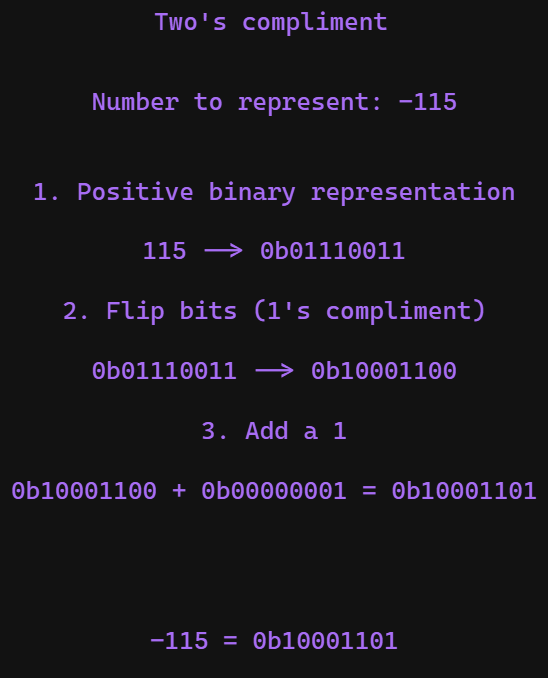
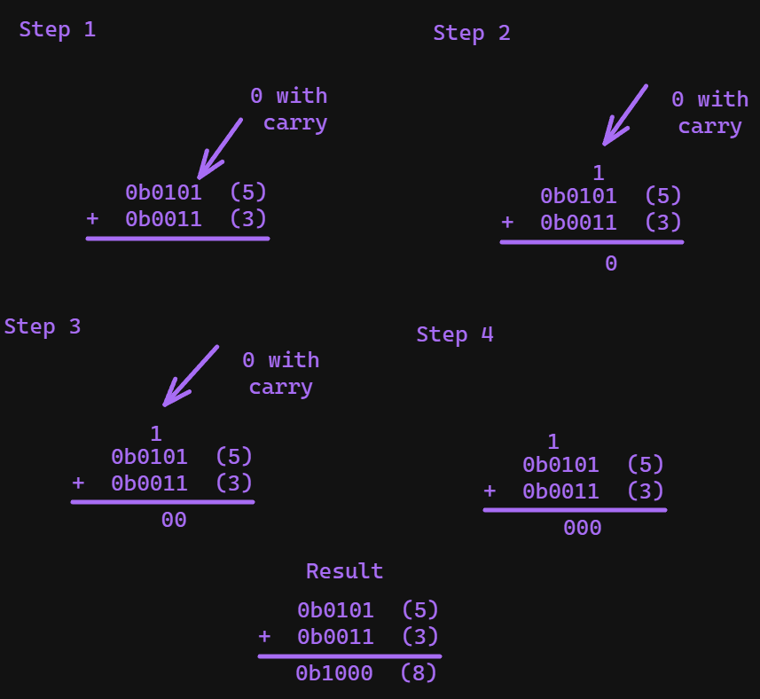
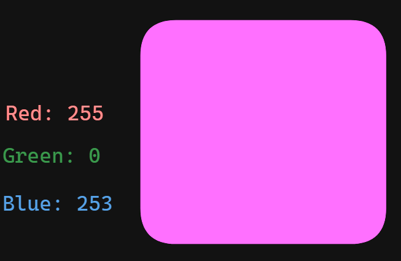
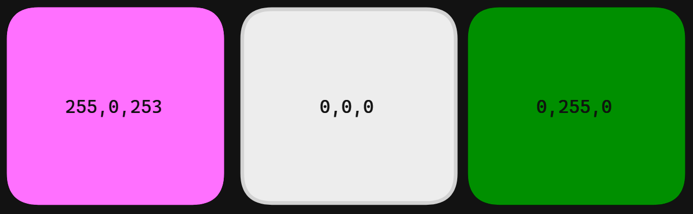
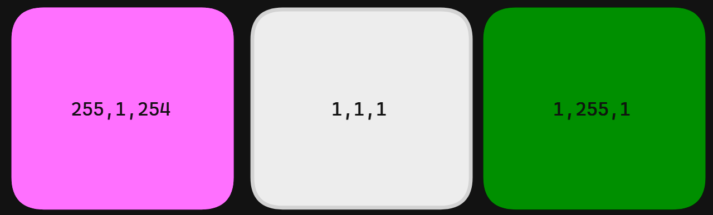

---
aliases:
  - binary
  - hex
title: Number Systems (binary & hex)
---

When we count we traditionally use base 10. Base 10 gives us 10 values before we shift digits. We go from 0-9, and then we shift 1 digit left, and start from 0 in the far right column again:
```
0
1
2
...
9
10
11
...
19
20
21
...
99
100
```

If we pad the left hand side of the columns with 0's (which doesn't change the value) this pattern becomes more apparent:

![[decimal-table.png]]

We end up essentially with a table. So if we think about it the number 123 is actually:

- 1 one hundred
- 1 twenty
- 1 three

Each representing the hundreds, tens and one's columns of the above table. As such when a value "spills over" it increases the digit by adding 1 to the left column of whatever overflows. 

## Powers of 10
Another way to view this is in powers of 10. I have put the minimum value of each column on top, and the maximum below:

![[decimals-in-tens.png]]


This same model will be used later to help explain other base numbering systems like binary and hex.

## Binary
Computers communicate using electrical signals. With these electrical signals we can represent 2 states, on and off. If the voltage is above 5v we can call it "on" or "true", and if the voltage is below that we can call if "off" or "false". With this system it lends itself towards binary. Binary is a base 2 numbering system. Base 2 means instead of 0-9 we have only 2 values, 1 and 0. In binary these 1's and 0's are called bits. We can have different sized binary numbers. For example this is a 4 bit binary number `0110` (6 in decimal), or an 8 bit number `01100110` (102 in decimal), 8 bits is traditionally called a byte. 

When you first start looking at the numbers, binary is easiest to think of as a kind of [truth table](https://www.techtarget.com/whatis/definition/truth-table) format. Let's start with an example, the number 123 is `0b1111011`. the `0b` is a **base indicator**, when we write numbers we need to know what system we're using, the b indicates we're in binary. So `123` is  `1111011`. How do we do this conversion? 
### Converting decimal numbers to binary

First we need to construct a table like we saw with the [[#Powers of 10 decimal]] representation we're going to start from `2^0`, and we want to go to `2^x` where `x` is the largest power of 2 that does not exceed our number. For 123 `2^7 = 128` which is larger than 123, so `2^6` is the magic number we want. For the steps I will include `2^7` to help show the steps clearly, but this wastes 1 bit of space storing our number. So let's build our table:

| 2^7 | 2^6 | 2^5 | 2^4 | 2^3 | 2^2 | 2^1 | 2^0 |
| ---- | ---- | ---- | ---- | ---- | ---- | ---- | ---- |
|  |  |  |  |  |  |  |  |

Which we can convert to whole numbers from the exponents to make it easier:

| 128 | 64 | 32 | 16 | 8 | 4 | 2 | 1 |
| ---- | ---- | ---- | ---- | ---- | ---- | ---- | ---- |
|  |  |  |  |  |  |  |  |

There is a video walkthrough of this section if you are interested. 

<iframe width="100%" height="400" src="https://www.youtube.com/embed/dOCHpNxWmUU?si=i00QppeSxB_1Ehk2" title="YouTube video player" frameborder="0" allow="accelerometer; autoplay; clipboard-write; encrypted-media; gyroscope; picture-in-picture; web-share" allowfullscreen></iframe>

#### The continuous subtract Algorithm
As we saw with decimal earlier, we can break up numbers into their constituent parts, so for 123 it's 1 one hundred 2 tens (twenty) and 3 ones (three). Now we have the table we are going to do the same, but broken up into powers of 2. Our algorithm for creating a binary number from a decimal is:
1. Keep track of a value called remainder, at the start remainder is equal to our decimal number
2. Start from the far left of the table for each cell
	1. if remainder < current cell: put a 0 and go one cell to the right
	2. else: put a 1 subtract the current cell value from remainder, and then move to the right
3. Continue step 2 until you reach the end of the table. 

You can do this by [[Algorithms & Complexity (TODO)#String Building (TODO)|building a string]], and converting it back to a number later. The pseudocode for this would be:
```
function convertToBinary(number){
  remainder = number
  
  // Assume 8 bits
  cells = [128,64,32,16,8,4,2,1]

  result = "0b" // Where we will add bits 1 at a time to
  
  for currentCell in cells{
    if remainder < currentCell{
      result.append("0")
    } else {
      result.append("1")
      remainder = remainder - currentCell
    }
  }
  
  // Some function to take the string representation and convert to a number
  return stringToBinary(result) 
  
}


```

For example the algorithm in python:

```python
def convert_to_binary(number:int) -> str:
  remainder = number # Step 1

  # Assume 8 bits
  cells = [128,64,32,16,8,4,2,1]
  result = "0b" # Where we will add bits 1 at a time to

  for currentCell in cells:
    if remainder < currentCell: # Step 2.1
      result += "0"
    else: # Step 2.2
      result += "1"
      remainder = remainder - currentCell
  return result

x = convert_to_binary(123) # 01111011

# Converts back to decimal
int(x, 2) # 123

# Can also create an int from a binary number
0b01111011 == 123
```


**First Cell**

So to start:

```
Remainder = 123
Current Cell = 128
remainder < Current Cell
```

So we follow step 2.1

| 128 | 64 | 32 | 16 | 8 | 4 | 2 | 1 |
| ---- | ---- | ---- | ---- | ---- | ---- | ---- | ---- |
| 0  |  |  |  |  |  |  |  |

**Second Cell**

Next:

```
Remainder = 123
Current Cell = 64
remainder > Current Cell
```

So we follow step 2.2

```
remainder = remainder - Current Cell
          = 123 - 64
          = 59
```

| 128 | 64 | 32 | 16 | 8 | 4 | 2 | 1 |
| ---- | ---- | ---- | ---- | ---- | ---- | ---- | ---- |
| 0 | 1 |  |  |  |  |  |  |

**Third Cell**

Now we continue:

```
Remainder = 59
Current Cell = 32
remainder > Current Cell
```

So we follow step 2.2

```
remainder = remainder - Current Cell
          = 59 - 32
          = 27
```

| 128 | 64 | 32 | 16 | 8 | 4 | 2 | 1 |
| ---- | ---- | ---- | ---- | ---- | ---- | ---- | ---- |
| 0 | 1 | 1 |  |  |  |  |  |

**Fourth Cell**

```
Remainder = 27
Current Cell = 16
remainder > Current Cell
```
So we follow step 2.2
```
remainder = remainder - Current Cell
          = 27 - 16
          = 11
```

| 128 | 64 | 32 | 16 | 8 | 4 | 2 | 1 |
| ---- | ---- | ---- | ---- | ---- | ---- | ---- | ---- |
| 0 | 1 | 1 | 1 |  |  |  |  |

**Fifth Cell**

```
Remainder = 11
Current Cell = 8
remainder > Current Cell
```
So we follow step 2.2

```
remainder = remainder - Current Cell
          = 11 - 8
          = 3
```

| 128 | 64 | 32 | 16 | 8 | 4 | 2 | 1 |
| ---- | ---- | ---- | ---- | ---- | ---- | ---- | ---- |
| 0 | 1 | 1 | 1 | 1 |  |  |  |

**Sixth Cell**

```
Remainder = 3
Current Cell = 4
remainder < Current Cell
```
So we follow step 2.1

| 128 | 64 | 32 | 16 | 8 | 4 | 2 | 1 |
| ---- | ---- | ---- | ---- | ---- | ---- | ---- | ---- |
| 0 | 1 | 1 | 1 | 1 | 0 |  |  |

**Seventh Cell**

```
Remainder = 3
Current Cell = 2
remainder > Current Cell
```
So we follow step 2.2

```
remainder = remainder - Current Cell
          = 3 - 2
          = 1
```

| 128 | 64 | 32 | 16 | 8 | 4 | 2 | 1 |
| ---- | ---- | ---- | ---- | ---- | ---- | ---- | ---- |
| 0 | 1 | 1 | 1 | 1 | 0 | 1 |  |

**Eighth Cell**

```
Remainder = 1
Current Cell = 1
remainder > Current Cell
```
So we follow step 2.2

```
remainder = remainder - Current Cell
          = 1 - 1
          = 0
```

| 128 | 64 | 32 | 16 | 8 | 4 | 2 | 1 |
| ---- | ---- | ---- | ---- | ---- | ---- | ---- | ---- |
| 0 | 1 | 1 | 1 | 1 | 0 | 1 | 1 |

So we're now left with `01111011`, and we just add our indicator to the front and we have `0b01111011`. Here's a familiar way to visualize this process:

![[binary-table-123.png]]
You know you've done it right if your remainder is 0.

### Converting binary numbers to decimal
Now we've seen how to convert number to binary, let's see about how to convert numbers from binary to decimal.
#### The continuous add Algorithm
Now we have the table our algorithm for creating a binary number from a decimal is:
1. Keep track of a value called result, at the start result is equal to 0
2. Start from the far right of the table for each cell
	1. if the value is a 1, add the value of the current cell to result
	2. If the value is 0, go to the next cell
3. Continue step 2 until you reach the end of the table

The pseudocode for this would be:

```
function convertToInteger(binary_number){
  remainder = number

  // Assume 8 bits
  cells = [1,2,4,8,16,32,64,128]

  // Create an array of the 0's and 1's of the number
  values = binary_number.split("") 

  result = 0 // Where we will add 1 cell at a time

  // Iterate the cells and values at the same time
  for value, currentCell in values, cells{
	 if value == 1{
		 result += currentCell
	 } 
    
  }
  
  return result
}

convertToInteger("01111011")
```

For example the algorithm in python:

```python
def convert_to_decimal(number:str) -> int:
  result = 0 # Step 1

  # Assume 8 bits
  cells = [128,64,32,16,8,4,2,1]
  cells = cells[::-1] # Reverse cells (simulates iterating from the right to left)

  number = number.replace("0b","") # Remove binary indicator

  for index, currentCell in enumerate(cells): # Step 2
      if index == len(number): # Is at end
          break  # Break so we don't double-add last value

      # Get current Value from end of list
      if number[-1*(index+1)] =="1": # Step 2.1 
          result += currentCell
  return result

x = bin(0b01111011)

convert_to_decimal(x) # 123
```

So if we were to take `0b01111011` and convert it to an integer we would start from the rightmost (least significant bit), to the left it would go:

| 128 | 64 | 32 | 16 | 8 | 4 | 2 | 1 |
| ---- | ---- | ---- | ---- | ---- | ---- | ---- | ---- |
| 0 | 1 | 1 | 1 | 1 | 0 | 1 | 1 |
1+2+8+16+64 = 123

![[bin-to-int-123.png]]

### Signed vs Unsigned
When talking about binary there are two possible representations, signed and unsigned. Signed numbers are numbers that allow negatives and positives as well as 0 (and sometimes negative 0[^2]). An unsigned integer however is **only able to be positive**. On top of this signed integers have multiple binary representations for how they show negatives and positives.

#### Signed magnitude
Signed magnitude binary will have a sign bit (usually the leftmost bit \[also called Most Significant bit or MSB]), which indicates if a value is positive or negative. Traditionally a 0 is positive, and 1 is negative. Since you have a sign bit you always lose 1 bit of data. So an 8 bit (1 byte) unsigned binary integer goes from being able to represent 0-255, to a signed integer being only able to represent -127-127. Unsigned on the other hand allows the leftmost bit to be part of the number, at the expense of **no negative numbers** being representable. 

| Signed (binary) | Unsigned (binary) |
| ---- | ---- |
| 00000000 = 0 | 00000000 = 0 |
| 10000000 = -0 | 10000000 = 128 |
| 00000001 = 1 | 00000001 = 1 |
| 10000001 = -1 | 10000001 = 128 |
| 10000110 = -6 | 10000110 = 134 |

*All are 8 bits (1 byte)*

#### Two's compliment
Much more commonly people represent signed integers using two's compliment form. This is a bit more complicated to implement, but has advantages, especially:

1. it makes binary operations[^1] the same as unsigned values
2. You don't need -0 and 0, just 0 

For any number you follow the following algorithm:

1. Represent the number in unsigned binary
2. Convert the number into one's compliment (flip all bits, so 0 becomes 1, and 1 becomes 0)
3. Add a 1 to the end

For example to represent -115 we would do:

1. Represent the number in unsigned binary: `0b01110011`
2. Convert the number into one's compliment (flip all bits, so 0 becomes 1, and 1 becomes 0): `0b10001100`
3. Add a 1 to the end: `0b10001100 + 0b0000001 = 0b10001101`




### Operations in Binary
You can do various operations in binary to manipulate values as needed. Some of these are the same normal math we would do with any numbers, but there are also special operations we use in binary for the typical uses for binary.
#### Bit Shifting 
Bit shifting does what it sounds like. A bit shift left will have you take all the bits in a binary number and move them one bit left. For example `0b00011000` bit shifted left 1 bit would give you `0b00110000`.  Here are the remaining bit shifts:

| Name | Symbol | Description | Example |
| ---- | ---- | ---- | ---- |
| Shift left | `<<` | Shifts all bits to the left | `0b0011 << 1 == 0b0110` |
| Arithmetic shift right | `>>` | Shifts bits to the right, the shift will maintain and pad with it's sign bit instead of 0 | `0b1011 >> 2 == 0b1110` |
| Logical shift right | `>>>` | Shifts bits to the right, the shift will pad with 0's | `0b1011 >> 2 == 0b0010` |
[^5]

There are binary operation (as in needs 2 arguments) and unary operation (needs only 1 argument) forms of bit shifting. For example `0b0100 << == 0b100` is the unary form, where it's assumed you want to shift left by 1, the binary operation form let's you specify how far to shift by, such as `0b0010 << 2 == 0b1000`. 
##### Overflows
An overflow occurs in two circumstances, a shift left when the most significant bit is a 1 (`0b10000000 << 1`), or a shift right when the least significant bit is a 1 (`0b00000001 >> 1` or `0b00000001 >>> 1`). In these cases there are various ways of handling the situation, in some cases there is a carry-in or carry-out bit, where there is a defined way to deal with these situations. In most languages however this just causes an overflow where the value is thrown away.

You do need to be careful about overflows because they can pose significant security risks in situations[^3] [^4].

#### Bit Masking
Bit masking is a technique where you *mask* a binary number, using another number in order to define a set of bits you want to perform an operation on. Similar to putting painters tape on a wall to define where you want paint to go, and where you don't want it to go. Let's say we take the 4 bit mask `0b0001`, this mask indicates that we only care about the least significant bit in the number. From there we can do various [[Logic Gates (TODO)#Boolean Logic|logical operations]] over that "field" of bits. This has a ton of uses, but the simplest is to check 1 bit for something.

Let's say we want to know if the 6th bit from the right is a 1, we could take our input number, use a bitmask, and perform a [[Logic Gates (TODO)|logical AND]] operation. If both are a 1, it will be a 1, else the 6th bit will be a 0. Therefore the only two possible values given the bitmask are 0 or 32. 

So for example:

```
   0b11011011 (input)
&  0b00100000 (mask)
--------------
   0b00000000
```
Going from least significant bit to most we perform the AND operation on each bit, but since every bit is 0 except the 6th, every other number is guaranteed to be 0. So the most important check is the sixth bit, where `0 & 1 == 0`, so we know the 6th bit is 0, since the whole number is 0. 

This may seem useless, but it's a powerful tool when combined with other operations. For example lots of hardware uses the [[#Binary Enumeration & Booleans|binary enumeration]] method to change the settings for hardware on a computer. Let's say the 3rd bit decides if the hardware is on or off. We can just use something like XOR to toggle the current setting whenever the user wants to make the change. This means we can trivially do the toggle in a single line of code: `input XOR 0b00000100`. This will toggle the third bit without us even having to check it. These operations can make things much more efficient.

#### Addition
For unsigned addition you can do it column by column, for each column:
- If there are two 1's, carry the bit to the next column
- If there is one 1, the result is 1
- If there are no one's the result is 0
Here is an example:

```
   0b0101  (5)
+  0b0011  (3)
---------
   0b1000  (8)
```
The steps would look like this



Consider a case now with overflow

```
   0b10010110    (150)
+  0b10000110    (134)
-------------
   0b100011100   (284)
```

In this case we need the overflow bit to represent our number, so we can't throw it away, instead we have to increase our bits. With unsigned two's compliment values we have two overflows that will break our operations:
1. When two negative numbers are summed and result is positive 
```
   0b1001 (-7)
 + 0b1101 (-3)
--------------
  0b10110 (-10) --> becomes 0b0110 (6)
```
2. When two positive numbers are summed and result is negative
```
   0b0111 (7)
 + 0b0001 (1)
--------------
  0b1000 (-8)
```

#### Subtraction 
...
- [Binary Addition and Subtraction With Negative Numbers, 2's Complements & Signed Magnitude (youtube.com)](https://www.youtube.com/watch?v=sJXTo3EZoxM)
#### Multiplication
Binary multiplication is similar to decimal multiplication but involves only the digits 0 and 1. Here's a step-by-step algorithm for binary multiplication:

1. **Write down the numbers:**
   Write the two binary numbers you want to multiply, one below the other.

   ```
      1101  (Multiplier)
   x   101  (Multiplicand)
   ```

2. **Multiply each bit:**
   Starting from the rightmost bit of the multiplier, multiply each bit by the entire multiplicand, just as you would in decimal multiplication. Write the intermediate products below each line.

   ```
         1101  (Multiplier)
      x   101  (Multiplicand)
      -----------
         1101  (Partial product when multiplied by 1)
      1101    (Shifted partial product when multiplied by 0)
      -----------
     100001  (Result of the multiplication)
   ```

3. **Add up the partial products:**
   Add up all the partial products to get the final result.

   ```
         1101  (Multiplier)
      x   101  (Multiplicand)
      -----------
         1101  (Partial product when multiplied by 1)
      1101    (Shifted partial product when multiplied by 0)
      -----------
     100001  (Result of the multiplication)
   ```

So, in this example, the binary multiplication result is 100001.
#### Division
Division in binary follows a process similar to division in decimal, but the base is 2 instead of 10. Here's a step-by-step algorithm for binary division:

1. **Align the Numbers:**
   Align the divisor with the leftmost part of the dividend. If the divisor is larger than the dividend, the quotient is 0, and the remainder is the dividend itself.

   ```
      110101  (Dividend)
   /   101   (Divisor)
   ```

2. **Initialize:**
   Set the quotient to zero and bring down the first digit of the dividend.

   ```
      110101  (Dividend)
   /   101   (Divisor)
     |
      1
   ```

3. **Divide:**
   Compare the divisor with the current partial dividend. If it's less than or equal to the partial dividend, subtract the divisor from the partial dividend, add 1 to the quotient, and bring down the next digit of the dividend. Otherwise, add a 0 to the quotient and bring down the next digit.

   ```
      110101  (Dividend)
   /   101   (Divisor)
     |  
      1       (Quotient)
     -101
      -----
       010
   ```

4. **Repeat:**
   Repeat step 3 until you have brought down all the digits of the dividend.

   ```
      110101  (Dividend)
   /   101   (Divisor)
       1       (Quotient)
     -101
      -----
       010
        10
      -----
        01
   ```

5. **Result:**
   The final quotient is the result, and the remainder is the remaining partial dividend.

   ```
      110101  (Dividend)
   /   101   (Divisor)
       1.01    (Quotient)
     -101
      -----
       010
        10
      -----
        01
   ```

So, in this example, the binary division result is Quotient = 1.01 and Remainder = 01.
### Uses & tricks
Binary in general is the basis of all computing, but what are some uses where interacting with binary is actually better than working with base 10. These cases typically are for efficiency and/or simplicity.
#### Binary Enumeration & Booleans
[[Advanced Data Structures (TODO)#Enumerator|Enumerators]] can be made with a binary number by interpreting the bits as one of the two available values. For example let's say we have some user settings in an app like:

```
premium: true or false
adult: true or false
useMobileData: true or false
theme: light or dark
```
Each of these user settings can be assigned a 1 (true/light) or 0 (false/dark). Therefore we could represent the entire state of the user with a 4 bit binary number. For example `0b1010` would indicate that the user is premium, not an adult, allows the use of mobile data and prefers a dark scheme:
```
premium: 1 (true)
adult: 0 (false)
useMobileData: 1 (true)
theme: 0 (dark)
```

#### Least Significant Bit Stenography
When looking at pixels there's an [[Encodings|encoding]] used where each pixel has 3 associated numbers between 0-255. So each pixel can be represented by 3 bytes (i.e. `0b11111111`, `0b00000000`, `0b11111101`). So in this case \[255, 0, 253] correspond to the amount of Red, Green, and Blue of that pixel. So in this case it's very red, has no green, and has a lot of blue, which gives us:


So let's say we wanted to secretly store a 9 bit message, and we have the following pixels:

So if we wanted to store `0b111111111` we just add the message to the least significant (leftmost) bit of each pixel:

This is what the modified image would look like. There's almost no perceptual difference, but you can now read the leftmost bit of each integer and get back our message.
#### Odds and evens
How can you tell if a number is odd or even in base 10? You divide by 0 and check if there's a remainder (you can use modulus to do this `4 % 2 == 0` therefore even). But for binary it's much faster, if the least significant bit is 1 the number is odd, else it's even. So for example without calculating `0b00110101 00110101` I know it's even because the rightmost bit is a 1.

The reason for this is because all powers of 2 **except** `2^1` are even, and summing any two even numbers is even. So any number that is odd **must** have a 1 in the rightmost bit so that it can be a non-power of 2 number. 

#### DHCP masks
In order to use the internet your router has to have an [[IP (internet Protocol)#IP addresses (TODO)|IP address]] for each device that wants to communicate. This would be tedious to do by hand (called static allocation), so instead we often use DHCP (Dynamic Host Configuration Protocol) to automatically rent IP addresses to devices. For IP addresses we use four 1 byte numbers to indicate an IP address. A DHCP subnet mask  allows you to specify how many IP addresses and which pattern to use.

For each mask you subtract 255 from the octet ant it tells you how many addresses are available. So for example:

| Configured base IP | Subnet mask | Range of addresses |
| ---- | ---- | ---- |
| 10.0.0.0 | 255.255.255.255 | 10.0.0.0 |
| 10.0.0.0 | 255.255.255.0 | 10.0.0.0-10.0.0.255 |
| 172.0.0.0 | 255.255.255.0 | 172.0.0.0-172.0.0.255 |
| 172.0.0.0 | 255.255.0.0 | 172.0.0.0-172.0.255.255 |
| 10.0.0.0 | 255.255.255.128 | 10.0.0.0-10.0.0.128 |

## Hexadecimal
Hexadecimal is a base 16 system. It works similar to binary and base 10, but the counting goes 0-9 then A-F. So for example:

| Decimal | Binary | Hexadecimal |
| ---- | ---- | ---- |
| 1 | `0b00000001` | `0x01` |
| 9 | `0b00001001` | `0x09` |
| 10 | `0b00001010` | `0x0A` |
| 11 | `0b00001011` | `0x0B` |
| 12 | `0b00001100` | `0x0C` |
| 13 | `0b00001101` | `0x0D` |
| 14 | `0b00001110` | `0x0E` |
| 15 | `0b00001111` | `0x0F` |
| 16 | `0b00010000` | `0x10` |
| 17 | `0b00010001` | `0x11` |
### Uses & Tricks
Hex has a ton of uses, many of them align with binary, and also relating to large values because hexadecimal is a more dense representation than even base 10.
#### Addressing
Because you can represent much larger numbers with hexadecimal it's used to indicate locations in [[RAM|memory]]. This comes up often when you're talking about [[Programming/Basics#Pointers (TODO)|pointers]].
#### Colour Values
In many systems you can represent colours using "hex codes". These are just hexadecimal numbers under the hood. The numbers themselves correspond to the amount of red, green and blue that makes up a colour (from 0-255). So for example `0xFF00FD` would give a pink pixel like:


There are also ones that add alpha channel (how transparent it is). For example `0xFF00FDFF` would produce the same as above `0xFF00FD7F` would be the same, but at %50 transparency and `0xFF00FD00` would be the same colour but fully transparent. A tool to visualize this can be found [here](https://rgbacolorpicker.com/hex-to-rgba). 
## Other Base systems
There is a base numbering system for about any numbered base. Most of them have very little practical use, but here are a few:

- Base 12 (duodecimal or dozenal)
	- Handy for times
		- 60 (seconds, minutes), 24 (1 day, hours in military time), and 12(hours in am/pm) are divisible by 12, which makes it easy to count seconds, minutes, hours, and days
	- [Duodecimal - Wikipedia](https://en.wikipedia.org/wiki/Duodecimal)
	- [Base 12 - Numberphile (youtube.com)](https://www.youtube.com/watch?v=U6xJfP7-HCc)
	- [Base 12: An Introduction | Built In](https://builtin.com/data-science/base-12)
	- [The Base Some Computers Use Instead of Binary (youtube.com)](https://www.youtube.com/watch?v=yfQVL0_POKg)

| Decimal | Duodecimal/dozenal | Pronunciation |
| ---- | ---- | ---- |
| 10 | X or 𝛘 | dek |
| 11 | E or ℰ | el |
| 12 | 10 | doe |
| 16 | 14 | doe-four |
| 22 | 1X or 1𝛘 | doe-dek |
| 23 | 1E or 1ℰ | doe-el |
| 24 | 20 | two-doe |
| 25 | 21 | two-doe-one |
| 60 | 50 | five-doe |
| 120 | X0 or 𝛘0 | dek-doe |
| 132 | E0 or ℰ0 | el-doe |
| 144 | 100 | doe-doe or gross |

- Base 3 (ternary)
	- Used in some logic systems to develop software, and some physics
	- Each value is called a trit (instead of bit like binary)
	- [Three-valued logic - Wikipedia](https://en.wikipedia.org/wiki/Three-valued_logic)
	- [Ternary System - an overview | ScienceDirect Topics](https://www.sciencedirect.com/topics/chemistry/ternary-system)
	- [5.4: Ternary Systems - Engineering LibreTexts](https://eng.libretexts.org/Bookshelves/Chemical_Engineering/Phase_Relations_in_Reservoir_Engineering_(Adewumi)/05%3A_Phase_Diagrams_IV/5.04%3A_Ternary_Systems)
	- [Douglas W. Jones on Ternary Logic (uiowa.edu)](https://homepage.cs.uiowa.edu/~dwjones/ternary/logic.shtml)

| Decimal | Ternary |
| ---- | ---- |
| 1 | 1 |
| 2 | 2 |
| 3 | 10 |
| 4 | 11 |
| 5 | 12 |
| 6 | 20 |
| 7 | 21 |
| 8 | 22 |
| 9 | 100 |
| 10 | 101 |
| 27 | 1000 |
| 81 | 10000 |
| 243 | 100000 |
| 729 | 1000000 |
| 2187 | 10000000 |
The maximum value of 8 trits is 6560 or `3^8 - 1 `


## Additional Resources

- Binary
	- [Why Use Binary? - Computerphile (youtube.com)](https://www.youtube.com/watch?v=thrx3SBEpL8)
	- [Where did Bytes Come From? - Computerphile (youtube.com)](https://www.youtube.com/watch?v=ixJCo0cyAuA)
	- [Binary Explained in 01100100 Seconds (youtube.com)](https://www.youtube.com/watch?v=zDNaUi2cjv4)
	- [Representing Numbers and Letters with Binary: Crash Course Computer Science #4 (youtube.com)](https://www.youtube.com/watch?v=1GSjbWt0c9M)
	- [Binary Numbers and Base Systems as Fast as Possible (youtube.com)](https://www.youtube.com/watch?v=LpuPe81bc2w)
	- [Why Do Computers Use 1s and 0s? Binary and Transistors Explained. (youtube.com)](https://www.youtube.com/watch?v=Xpk67YzOn5w)
	- [What are binary numbers?|James May's Q&A (Ep 11100)|Head Squeeze (youtube.com)](https://www.youtube.com/watch?v=kcTwu6TFZ08)
	- [Signed and Unsigned Binary Numbers (youtube.com)](https://www.youtube.com/watch?v=YYAU1hZUbwY)
	- LSB stenography
		- [Least Significant Bit Steganography in Under 60 Seconds (youtube.com)](https://www.youtube.com/watch?v=i3tsseGodfI)
		- [Steganography Explanation and Code Examples (LSB) (youtube.com)](https://www.youtube.com/watch?v=ZFGlJGwaN2w)
		- [LSB Image Steganography Using Python | by Devang Jain | The Startup | Medium](https://medium.com/swlh/lsb-image-steganography-using-python-2bbbee2c69a2)
		- [https://iopscience.iop.org/article/10.1088/1742-6596/1898/1/012003/pdf](https://iopscience.iop.org/article/10.1088/1742-6596/1898/1/012003/pdf#:~:text=One%20of%20the%20simplest%20methods,medium%20to%20hide%20the%20message.)
		- [040009_1_online.pdf (silverchair.com)](https://watermark.silverchair.com/040009_1_online.pdf?token=AQECAHi208BE49Ooan9kkhW_Ercy7Dm3ZL_9Cf3qfKAc485ysgAABYAwggV8BgkqhkiG9w0BBwagggVtMIIFaQIBADCCBWIGCSqGSIb3DQEHATAeBglghkgBZQMEAS4wEQQMY9YrelpzO8zvcRL7AgEQgIIFM5RdpQ7yRx4WJRoUmEfifqp8ly76lExGp59GuHEj4yQ9vV-YPX0pn9XMRb770LK_WNkYTo8UbLyvRFDRDgTGtn-SDzDBoaWIdfQ-x0O3bAu9wP0gieyWbjMtJxJokK0NgGWWEp8VkhV9pGIKVTptk6ukbP_utgJdoOWI9bMOfZf4i5CueD-bOyx_xA-3yUtK-NKlgnLgkh8m9lRG1zm_Hf8lJFc7kMVTlSQV9Rmo-IXb5I8ljkaroRNtMeygLJyXfj8GtqTNMi3xhnAbWtGXsqRdgbBi-yNBHr4rnwzvoYgPCcVrMV0Xg0ey7CimN0_lgQBjyWK8HZ6On6Xg-L9vc-ARW324NH-6dFWeyULwFBQJjwOW1AnjXF1lp6vl2rit42ElrGKhg-PwGV1_iCEHMKgnmLbcWoMYKpB6vCYhemBVaxHMGw0LA2lfuEw3JgoZkKP6cRFMaDzsCe-0pQHEGu7dyA-_gVimSI5t-MM4tgOr5zwQ5uhJ_wyu7jg4fvhacf82_drNBTwp3jeuP9e2clpYWBpMODxnhEmxELxg0YvG8jBTPc1XQgO78O6-KGX2wsBtiCl4qlhQZAZTGlJZw7CsuXlwwY_ph4O4i6Nldk1PmdQ0V1YlrtqG1b9RuEs0hvxdSll4E4Zs0Ca0X7MiKdIrSTaG4i_ZWwBIBPa75Rk2ui0TG7apcKIdaG3u1w2ltI4J7UqoldoAw4aAwBnHC4Zg7mDcRGeWBXbXc7RGFAm75ooLztBIbyH8kl-xrLwbwv1vwfyXMyEBApoiz2TYjuvrQW8mJ_3mdDKAXxcm43tn34aRQ_Aq2ZhlR3L1kueReOpvkQoCiuZ7TCMzAqb8IQsOPE0vqlWNfSfJUYIIPd4nKJjYEEowZE22vC2CETCrsQ-LjWXuJBPUfmVlbuT85OU8BaKS5fT1bU078NRkkQJF70v2Oi5Ws25fUfLN5SAwwOZXn_kMcQMtYGhh05KPKe7_OKgEFdMdwKDH3TUz0dWdivC2_ohZG3rzwzYEsYQZIXF0CzBh8zCy76JRqJQP60-a9COR8G3UM42asoTJynYRnlnkU4cDq-6L89zQnf8I7owA4Zkv_0CC4BXuJarFUny5Esl7Oo5OUaKmxW9Q56OmVBDHiV-HC4Syp1B2R15olaHkNmMBImOHSdZpnM3pmBwPMoHqWqg7yAYYacDT1cxLmOIZKy9BqLoCnUzJdvzLHRXucQNMVC5P2K5xZYSzt2sKsoDQy-scuA-G5urIm5lWDebHMVY4SMUkBuCW4nObaOn2HAxr0F_9z73Xd-qPOj3kcQoBIHM6q1v3f8d4qAeI5rTTncbCmplb1tpToD2F65ih-VPMCb44Hvyvdvlgj7CE1zU-TYf0U5FHvy8FEGRX0Bj7HSSB6wBSUavAvY4EttB344J4wPqOEAVLmRsNaR49BR8_MVaCrgcxZC1d9ZaSlkL5DV8CystQ1eP1dN1SnztcgLChsEmdcBN6CqPVqoMjBqEAg1SRBiJIBIw47uX71zlqSpOG0Jile4NtfvkZVJUL0QKwZWK3tU3tKLxC9PFn_Q79cORZaBwIhYNiaxQo75OAOQr4u_IaAPHo-qXAzdRajaae6BclGoYJ9T0gq7v2sFTBUT-MD5jPXALRtzCkA15JMEaXvv7ZgXRIrLNTX4F22Q2ChD77wkGIgEcI3A2DJlQ2m8A-nqfMy7SZXZ0q1IqsnPksxKJVBL1DDNYI0lGNSmx-MnxwoJIu_zewS05rt22mSZ3522_UhcKX0lC0d6YB)
	- IEEE 754
		- The standard for how to represent numbers
		- [IEEE Floating-Point Representation | Microsoft Learn](https://learn.microsoft.com/en-us/cpp/build/ieee-floating-point-representation?view=msvc-170)
		- [IEEE 754 - Wikipedia](https://en.wikipedia.org/wiki/IEEE_754)
	- Two's compliment
		- [Binary: Plusses & Minuses (Why We Use Two's Complement) - Computerphile (youtube.com)](https://www.youtube.com/watch?v=lKTsv6iVxV4)
		- [Twos complement: Negative numbers in binary - YouTube](https://www.youtube.com/watch?v=4qH4unVtJkE)
		- [Why does 2s complement work? (youtube.com)](https://www.youtube.com/watch?v=X6LrOV1r_34)
	- Overflows
		- [16 - carry overflow (youtube.com)](https://www.youtube.com/watch?v=DiYfguraGsU)
		- [Binary Overflow (youtube.com)](https://www.youtube.com/watch?v=Q7t9-Sq_4Ww)
	- Subnet Masking
		- [TCP/IP addressing and subnetting - Windows Client | Microsoft Learn](https://learn.microsoft.com/en-us/troubleshoot/windows-client/networking/tcpip-addressing-and-subnetting)
		- [IP address network and host portion | subnet mask explained | ccna 200-301 free | (youtube.com)](https://www.youtube.com/watch?v=eHV1aOnu7oM)
		- [What is a Subnet Mask??? (you NEED to know it!!) (youtube.com)](https://www.youtube.com/watch?v=oZGZRtaGyG8)
		- [Subnet Mask - Explained (youtube.com)](https://www.youtube.com/watch?v=s_Ntt6eTn94)
- Hexadecimal
	- Memory addressing 
		- [Hex_Memory_Addressing.pdf (iitkgp.ac.in)](http://www.facweb.iitkgp.ac.in/~bibhas/Hex_Memory_Addressing.pdf)
		- [language agnostic - Why are memory addresses are represented using hexadecimal numbers? - Stack Overflow](https://stackoverflow.com/questions/5329916/why-are-memory-addresses-are-represented-using-hexadecimal-numbers)
		- [Lecture 4 - CS50 (harvard.edu)](https://cs50.harvard.edu/college/2021/spring/notes/4/)

[^1]: https://stackoverflow.com/a/1125317
[^2]: https://learn.microsoft.com/en-us/cpp/build/ieee-floating-point-representation?view=msvc-170#zero
[^3]: [Integer Overflow Attack and Prevention | SecureCoding.com](https://www.securecoding.com/blog/integer-overflow-attack-and-prevention/)
[^4]: [Integer Overflow - an overview | ScienceDirect Topics](https://www.sciencedirect.com/topics/computer-science/integer-overflow#:~:text=Buffer%20overflow%20vulnerabilities%20typically%20arise,by%20part%20of%20the%20data.)
[^5]: [language agnostic - What are bitwise shift (bit-shift) operators and how do they work? - Stack Overflow](https://stackoverflow.com/questions/141525/what-are-bitwise-shift-bit-shift-operators-and-how-do-they-work)